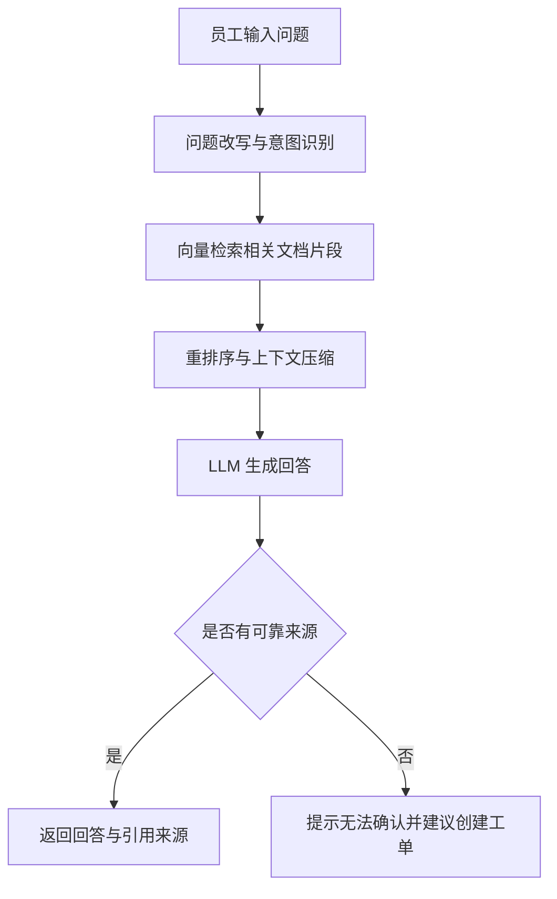
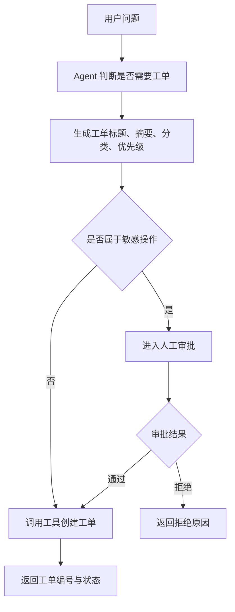
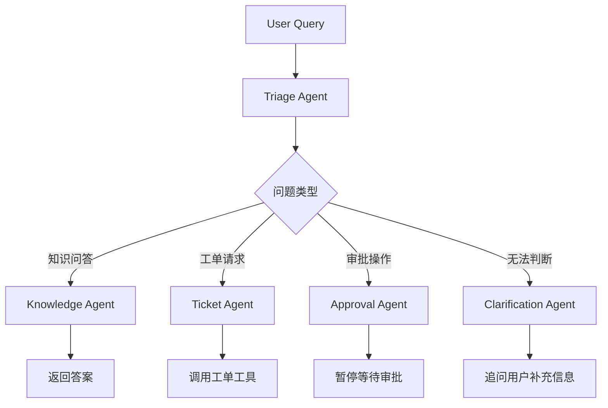
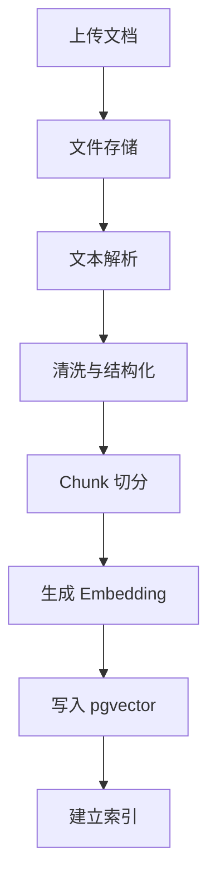
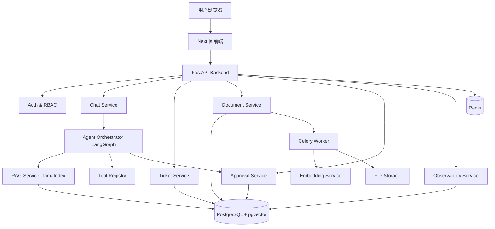

# Enterprise Support Agent 需求文档

> 企业知识库与智能工单处理 AI Agent
> 面向企业内部员工的 AI 支持系统，支持知识库问答、工单自动创建、任务流转、人工审批和效果评测。

---

## 1. 项目背景

企业内部通常存在大量分散文档，例如 HR 制度、IT 操作文档、财务报销规范、产品说明、售后 FAQ、合同模板等。员工在遇到问题时，往往需要在多个系统中搜索文档、询问同事或提交工单，效率较低。

本项目希望构建一个企业内部 AI Agent 系统，使员工可以通过自然语言提问，系统自动从知识库中检索相关内容，生成带引用来源的回答，并在需要时自动创建工单、分派部门、补充工单摘要。对于涉及敏感操作的任务，例如权限申请、退款、合同审批、账号变更等，系统需要引入人工确认机制，避免 AI 直接执行高风险操作。

本项目不是简单的“文档问答机器人”，而是一个具备业务流程能力的 AI Agent 应用。

---

## 2. 项目目标

### 2.1 核心目标

构建一个支持以下能力的企业级 AI Agent 应用：

1. 支持企业文档上传、解析、切分、向量化和检索。
2. 支持基于 RAG 的知识库问答，回答必须带来源引用。
3. 支持多轮对话，能够理解上下文。
4. 支持 Agent 工具调用，例如创建工单、查询工单、更新工单状态。
5. 支持 Human-in-the-loop，对敏感操作进行人工审批。
6. 支持运行日志、工具调用日志、检索命中日志和回答评测。
7. 支持后台管理，包括文档管理、工单管理、审批管理和数据看板。

### 2.2 简历展示目标

该项目需要体现以下 AI 应用工程能力：

* RAG 系统设计能力
* Agent Workflow 编排能力
* LLM 工具调用能力
* 后端 API 设计能力
* 数据库建模能力
* 权限与审批流程设计能力
* 可观测与评测能力
* Docker 化部署能力

---

## 3. 参考项目与差异化设计

### 3.1 参考项目

| 项目                                  | 可参考能力                              | 本项目借鉴点             |
| ----------------------------------- | ---------------------------------- | ------------------ |
| Dify                                | AI Workflow、RAG Pipeline、Agent、可观测 | 借鉴工作流、知识库管理、日志面板   |
| RAGFlow                             | 企业级 RAG、深度文档理解、引用来源                | 借鉴文档解析、检索、回答溯源     |
| AnythingLLM                         | 多用户知识库、Workspace、Agent             | 借鉴多空间、多文档管理体验      |
| Flowise                             | 可视化 Agent/RAG 流程                   | 借鉴流程节点概念，但不做复杂拖拽   |
| LangGraph                           | 有状态 Agent、长流程、人工审批                 | 用于工单 Agent 流程编排    |
| OpenAI Customer Service Agents Demo | 客服分流、Agent Handoff、业务动作            | 借鉴客服/工单业务流程        |
| OpenAI Agents SDK                   | Tools、Handoffs、Tracing、Sessions    | 用于 Agent 工具调用和链路追踪 |
| LlamaIndex                          | 文档摄取、索引、查询工作流                      | 用于知识库 RAG 核心链路     |

### 3.2 本项目差异化

本项目不做一个庞大的低代码 AI 平台，而是聚焦一个清晰业务场景：

> 企业员工支持场景：员工提问 → 知识库检索 → AI 回答 → 判断是否需要工单 → 创建工单 → 人工审批 → 工单流转 → 效果评测。

核心差异点：

1. 聚焦企业内部支持场景，而不是通用聊天机器人。
2. 强调“问答 + 工单 + 审批”的业务闭环。
3. 强调回答可追溯，每个答案都需要展示引用来源。
4. 强调 Agent 可控性，高风险工具调用必须人工确认。
5. 强调工程化能力，包括日志、评测、错误重试和部署。

---

## 4. 用户角色

### 4.1 普通员工

普通员工是主要使用者，可以：

* 提交自然语言问题
* 查看 AI 回答和引用来源
* 继续追问
* 发起工单
* 查看自己的工单状态

### 4.2 部门处理人

部门处理人负责处理工单，可以：

* 查看分配给自己的工单
* 更新工单状态
* 回复工单
* 查看 AI 自动生成的工单摘要
* 修改 AI 推荐的工单分类

### 4.3 审批人

审批人负责处理高风险操作，可以：

* 查看待审批操作
* 批准或拒绝 AI 工具调用
* 填写审批意见
* 查看审批前后的 Agent 执行上下文

### 4.4 管理员

管理员负责系统配置，可以：

* 上传和管理知识库文档
* 管理用户和角色
* 配置部门分类
* 配置敏感操作策略
* 查看系统运行日志和评测指标

---

## 5. 核心业务流程

### 5.1 知识库问答流程



### 5.2 工单创建流程



### 5.3 Agent 编排流程



---

## 6. 功能需求

## 6.1 用户端功能

### 6.1.1 登录与角色识别

用户可以通过账号密码登录系统。系统根据用户角色展示不同功能入口。

MVP 阶段支持：

* 普通员工
* 管理员
* 审批人
* 工单处理人

后续可接入企业 SSO。

### 6.1.2 AI 问答

用户可以在聊天页面输入问题，例如：

* “公司的年假规则是什么？”
* “我电脑连不上 VPN 怎么办？”
* “报销发票抬头写错了怎么办？”
* “帮我申请 GitLab 项目权限。”
* “我想提交一个 IT 工单。”

系统需要返回：

* AI 回答内容
* 引用文档名称
* 引用片段
* 置信度
* 是否建议创建工单

### 6.1.3 多轮对话

系统需要支持上下文追问，例如：

用户：“报销发票抬头写错了怎么办？”
AI：返回报销规则。
用户：“那我已经提交了还能改吗？”
AI：结合上一轮问题继续回答。

### 6.1.4 创建工单

用户可以通过自然语言创建工单，例如：

> “帮我创建一个 IT 工单，我的公司邮箱无法登录。”

Agent 需要自动生成：

* 工单标题
* 工单描述
* 工单分类
* 优先级
* 处理部门
* 用户联系方式

用户确认后，系统创建工单。

### 6.1.5 查看工单

用户可以查看自己创建的工单列表，包括：

* 工单编号
* 标题
* 分类
* 状态
* 优先级
* 创建时间
* 更新时间
* 处理人回复

---

## 6.2 管理端功能

### 6.2.1 文档上传

管理员可以上传以下类型文档：

* PDF
* Markdown
* TXT
* DOCX
* CSV
* HTML

MVP 阶段优先支持 PDF、Markdown、TXT。

上传后系统需要自动执行：

1. 文件存储
2. 文本解析
3. 文档切分
4. 生成 embedding
5. 写入向量数据库
6. 记录处理状态

### 6.2.2 文档管理

管理员可以查看文档列表，包括：

* 文档名称
* 文档类型
* 所属知识库
* 上传人
* 解析状态
* chunk 数量
* 上传时间
* 更新时间

管理员可以执行：

* 删除文档
* 重新解析
* 查看文档片段
* 禁用文档
* 修改文档所属分类

### 6.2.3 知识库管理

管理员可以创建不同知识库，例如：

* HR 知识库
* IT 知识库
* 财务知识库
* 产品知识库
* 售后知识库

每个知识库支持配置：

* 知识库名称
* 描述
* 可访问角色
* 默认检索 top_k
* 相似度阈值
* 是否启用重排序
* 是否允许被 Agent 调用

### 6.2.4 工单管理

管理员和处理人可以查看所有工单，支持：

* 按状态筛选
* 按分类筛选
* 按优先级筛选
* 按处理人筛选
* 按创建时间筛选
* 修改工单状态
* 添加处理备注
* 转派工单

工单状态包括：

* 待确认
* 待处理
* 处理中
* 等待用户补充
* 已解决
* 已关闭
* 已拒绝

### 6.2.5 审批管理

对于敏感操作，系统不直接执行，而是创建审批记录。

敏感操作包括：

* 创建高优先级工单
* 修改用户权限
* 发送外部邮件
* 调用外部系统 API
* 修改工单处理人
* 关闭工单
* 导出敏感数据

审批人可以：

* 查看待审批操作
* 查看 Agent 请求执行的工具
* 查看工具参数
* 查看相关对话上下文
* 批准执行
* 拒绝执行
* 填写审批意见

---

## 6.3 Agent 功能

### 6.3.1 Triage Agent

Triage Agent 负责判断用户意图，并决定后续流向。

支持识别以下意图：

* 知识库问答
* 工单创建
* 工单查询
* 工单更新
* 审批请求
* 闲聊或无关问题
* 信息不足，需要追问

输出结构：

```json
{
  "intent": "knowledge_qa | create_ticket | query_ticket | update_ticket | approval | clarification | out_of_scope",
  "department": "HR | IT | Finance | Product | Support | Unknown",
  "confidence": 0.87,
  "need_ticket": true,
  "need_human_approval": false,
  "reason": "用户描述了 IT 账号登录问题，需要创建 IT 工单"
}
```

### 6.3.2 Knowledge Agent

Knowledge Agent 负责知识库问答。

流程：

1. 接收用户问题。
2. 根据问题识别目标知识库。
3. 调用检索工具。
4. 获取相关文档片段。
5. 判断上下文是否足够。
6. 生成回答。
7. 返回引用来源。

回答约束：

* 不允许编造制度和流程。
* 没有检索到依据时，必须明确说明“不确定”。
* 必须返回引用文档。
* 必须区分事实回答和建议。
* 必须支持继续追问。

### 6.3.3 Ticket Agent

Ticket Agent 负责工单生成和流转。

支持工具：

* create_ticket
* query_ticket
* update_ticket
* assign_ticket
* add_ticket_comment

创建工单时需要提取：

```json
{
  "title": "公司邮箱无法登录",
  "description": "用户反馈无法登录公司邮箱，需要 IT 排查账号状态或密码问题。",
  "category": "IT",
  "priority": "medium",
  "requester_id": "user_123",
  "assignee_group": "IT Support",
  "source_conversation_id": "conv_001"
}
```

### 6.3.4 Approval Agent

Approval Agent 负责敏感操作审批。

当工具调用命中敏感策略时，Agent 需要暂停执行，并创建审批记录。

审批通过后继续执行原工具调用。
审批拒绝后停止执行，并向用户说明原因。

### 6.3.5 Clarification Agent

当用户输入信息不足时，系统需要追问用户，而不是直接猜测。

例如：

用户：“帮我申请权限。”
AI：“请问你需要申请哪个系统的权限？例如 GitLab、飞书后台、CRM 或数据库。”

---

## 7. RAG 设计

### 7.1 文档处理流程



### 7.2 Chunk 策略

默认策略：

* chunk_size：800 中文字符
* chunk_overlap：120 中文字符
* 按标题、段落、表格优先切分
* 保留文档标题、页码、章节名等 metadata
* 表格内容转为 Markdown table 后再入库

Chunk metadata 示例：

```json
{
  "document_id": "doc_001",
  "knowledge_base_id": "kb_hr",
  "title": "员工休假制度",
  "section": "年假规则",
  "page": 3,
  "source_file": "hr_policy.pdf",
  "created_at": "2026-06-23T10:00:00"
}
```

### 7.3 检索策略

MVP 阶段采用混合检索：

1. 向量检索：根据语义相似度召回相关 chunk。
2. 关键词检索：对专业名词、制度名称、工单编号进行补充召回。
3. 重排序：对召回结果进行 rerank。
4. 上下文压缩：去除重复片段，控制 token 长度。
5. 引用返回：返回文档名、章节、页码和片段。

### 7.4 回答生成约束

系统 Prompt 需要约束：

* 只能基于检索结果回答。
* 找不到依据时不能编造。
* 回答中必须包含“引用来源”。
* 涉及制度、财务、合同、权限时要谨慎。
* 涉及操作性请求时，应判断是否需要创建工单。
* 涉及敏感操作时，应进入审批流程。

---

## 8. 技术选型

## 8.1 总体技术栈

| 层级        | 技术                                     | 选择原因                                        |
| --------- | -------------------------------------- | ------------------------------------------- |
| 前端        | Next.js + React + TypeScript           | 适合快速构建后台管理系统和聊天 UI，生态成熟，简历认可度高              |
| UI        | shadcn/ui + Tailwind CSS               | 开发效率高，适合做简洁后台和 Agent Console                |
| 后端        | Python + FastAPI                       | Python 适合 AI 应用开发，FastAPI 适合构建高性能 API 服务    |
| Agent 编排  | LangGraph                              | 适合有状态、多步骤、可暂停恢复、人工审批的 Agent Workflow        |
| Agent SDK | OpenAI Agents SDK                      | 适合实现工具调用、handoff、session、tracing 等 Agent 能力 |
| RAG 框架    | LlamaIndex                             | 适合文档摄取、索引、检索和查询工作流                          |
| 数据库       | PostgreSQL                             | 业务数据、用户、工单、审批、日志统一存储                        |
| 向量检索      | pgvector                               | 避免单独维护向量数据库，降低部署复杂度，适合个人项目                  |
| 缓存        | Redis                                  | 存储会话状态、任务状态、限流计数                            |
| 异步任务      | Celery + Redis                         | 处理文档解析、embedding、批量评测等耗时任务                  |
| 文件存储      | MinIO / 本地存储                           | MVP 阶段可本地存储，进阶阶段可切换 S3/MinIO                |
| 鉴权        | JWT + RBAC                             | 实现用户登录和角色权限控制                               |
| 日志        | structlog / loguru                     | 记录 Agent 执行、工具调用和错误日志                       |
| 可观测       | OpenTelemetry / LangSmith / 自建 Trace 表 | 追踪一次对话中的检索、LLM、工具调用、审批链路                    |
| 评测        | Ragas + 自定义指标                          | 评估 RAG 回答质量、忠实度、上下文命中率                      |
| 部署        | Docker Compose                         | 方便本地演示和部署，适合简历项目展示                          |

---

## 8.2 为什么不直接使用 Dify / RAGFlow

Dify 和 RAGFlow 是成熟平台，但如果简历只写“基于 Dify 搭建知识库”，容易显得像工具使用者，而不是 AI 应用工程师。

本项目选择自己实现核心链路：

* 自己实现文档上传与解析流程
* 自己实现 RAG 检索与引用来源
* 自己实现 Agent 状态流转
* 自己实现工单工具调用
* 自己实现人工审批
* 自己实现日志与评测

这样更能体现工程能力。

---

## 8.3 为什么选择 LangGraph

工单系统不是一次性问答，而是一个长流程：

1. 用户提出问题。
2. 系统识别意图。
3. 检索知识库。
4. 判断是否需要工单。
5. 判断是否需要审批。
6. 暂停等待人工确认。
7. 审批通过后继续执行。
8. 记录执行结果。

LangGraph 适合这种有状态、多步骤、可中断、可恢复的 Agent Workflow。

---

## 8.4 为什么选择 LlamaIndex

项目核心是企业文档知识库。LlamaIndex 在文档摄取、切分、索引、查询方面比较成熟，适合快速实现 RAG 链路。

本项目使用 LlamaIndex 处理：

* 文档加载
* 文档解析
* chunk 切分
* metadata 管理
* index 构建
* query engine
* retriever

---

## 8.5 为什么选择 PostgreSQL + pgvector

个人项目不建议一开始引入过多基础设施。如果同时维护 PostgreSQL、Milvus、Elasticsearch、Redis，复杂度会过高。

PostgreSQL + pgvector 的优势：

* 业务数据和向量数据可以放在同一个数据库中。
* 部署简单。
* 支持 SQL 查询。
* 方便和用户、文档、工单、审批表关联。
* 适合中小规模知识库场景。
* 简历表达足够专业。

---

## 8.6 为什么选择 FastAPI

FastAPI 适合 AI 应用后端，原因：

* Python 生态适合接入 LLM、RAG、embedding、Agent 框架。
* FastAPI 对异步接口支持较好。
* 自动生成 OpenAPI 文档。
* 适合前后端分离。
* 项目结构清晰，便于展示后端工程能力。

---

## 9. 系统架构

### 9.1 架构图



### 9.2 后端模块划分

```text
backend/
  app/
    main.py
    core/
      config.py
      security.py
      logging.py
    api/
      auth.py
      chat.py
      documents.py
      tickets.py
      approvals.py
      admin.py
      evals.py
    services/
      agent_service.py
      rag_service.py
      document_service.py
      ticket_service.py
      approval_service.py
      eval_service.py
    agents/
      triage_agent.py
      knowledge_agent.py
      ticket_agent.py
      approval_agent.py
      prompts/
    tools/
      ticket_tools.py
      document_tools.py
      approval_tools.py
    models/
      user.py
      document.py
      chunk.py
      ticket.py
      approval.py
      conversation.py
      trace.py
    workers/
      document_ingest_worker.py
      eval_worker.py
```

### 9.3 前端页面

```text
frontend/
  app/
    login/
    chat/
    tickets/
    approvals/
    admin/
      documents/
      knowledge-bases/
      users/
      traces/
      evals/
```

---

## 10. 数据库设计

### 10.1 users 用户表

| 字段            | 类型        | 说明                                    |
| ------------- | --------- | ------------------------------------- |
| id            | uuid      | 用户 ID                                 |
| email         | varchar   | 邮箱                                    |
| name          | varchar   | 姓名                                    |
| password_hash | varchar   | 密码哈希                                  |
| role          | varchar   | employee / handler / approver / admin |
| department    | varchar   | 所属部门                                  |
| created_at    | timestamp | 创建时间                                  |
| updated_at    | timestamp | 更新时间                                  |

### 10.2 knowledge_bases 知识库表

| 字段                   | 类型        | 说明                            |
| -------------------- | --------- | ----------------------------- |
| id                   | uuid      | 知识库 ID                        |
| name                 | varchar   | 知识库名称                         |
| description          | text      | 描述                            |
| owner_id             | uuid      | 创建人                           |
| visibility           | varchar   | private / department / public |
| top_k                | int       | 默认召回数量                        |
| similarity_threshold | float     | 相似度阈值                         |
| created_at           | timestamp | 创建时间                          |

### 10.3 documents 文档表

| 字段                | 类型        | 说明                                        |
| ----------------- | --------- | ----------------------------------------- |
| id                | uuid      | 文档 ID                                     |
| knowledge_base_id | uuid      | 所属知识库                                     |
| filename          | varchar   | 文件名                                       |
| file_type         | varchar   | 文件类型                                      |
| file_path         | varchar   | 文件存储路径                                    |
| status            | varchar   | pending / processing / completed / failed |
| chunk_count       | int       | chunk 数量                                  |
| uploaded_by       | uuid      | 上传人                                       |
| created_at        | timestamp | 创建时间                                      |

### 10.4 document_chunks 文档片段表

| 字段                | 类型        | 说明        |
| ----------------- | --------- | --------- |
| id                | uuid      | chunk ID  |
| document_id       | uuid      | 文档 ID     |
| knowledge_base_id | uuid      | 知识库 ID    |
| content           | text      | chunk 内容  |
| embedding         | vector    | 向量        |
| metadata          | jsonb     | 页码、标题、章节等 |
| created_at        | timestamp | 创建时间      |

### 10.5 conversations 对话表

| 字段         | 类型        | 说明    |
| ---------- | --------- | ----- |
| id         | uuid      | 对话 ID |
| user_id    | uuid      | 用户 ID |
| title      | varchar   | 对话标题  |
| created_at | timestamp | 创建时间  |
| updated_at | timestamp | 更新时间  |

### 10.6 messages 消息表

| 字段              | 类型        | 说明                      |
| --------------- | --------- | ----------------------- |
| id              | uuid      | 消息 ID                   |
| conversation_id | uuid      | 对话 ID                   |
| role            | varchar   | user / assistant / tool |
| content         | text      | 消息内容                    |
| metadata        | jsonb     | 引用来源、工具调用等              |
| created_at      | timestamp | 创建时间                    |

### 10.7 tickets 工单表

| 字段                     | 类型        | 说明                                                  |
| ---------------------- | --------- | --------------------------------------------------- |
| id                     | uuid      | 工单 ID                                               |
| ticket_no              | varchar   | 工单编号                                                |
| title                  | varchar   | 标题                                                  |
| description            | text      | 描述                                                  |
| category               | varchar   | IT / HR / Finance / Product / Support               |
| priority               | varchar   | low / medium / high / urgent                        |
| status                 | varchar   | pending / processing / resolved / closed / rejected |
| requester_id           | uuid      | 请求人                                                 |
| assignee_id            | uuid      | 处理人                                                 |
| source_conversation_id | uuid      | 来源对话                                                |
| created_at             | timestamp | 创建时间                                                |
| updated_at             | timestamp | 更新时间                                                |

### 10.8 approvals 审批表

| 字段               | 类型        | 说明                            |
| ---------------- | --------- | ----------------------------- |
| id               | uuid      | 审批 ID                         |
| action_type      | varchar   | 工具动作类型                        |
| tool_name        | varchar   | 工具名称                          |
| tool_args        | jsonb     | 工具参数                          |
| status           | varchar   | pending / approved / rejected |
| requester_id     | uuid      | 发起人                           |
| approver_id      | uuid      | 审批人                           |
| reason           | text      | 审批原因                          |
| decision_comment | text      | 审批意见                          |
| created_at       | timestamp | 创建时间                          |
| updated_at       | timestamp | 更新时间                          |

### 10.9 agent_traces Agent 执行链路表

| 字段              | 类型        | 说明       |
| --------------- | --------- | -------- |
| id              | uuid      | Trace ID |
| conversation_id | uuid      | 对话 ID    |
| user_id         | uuid      | 用户 ID    |
| agent_name      | varchar   | Agent 名称 |
| step_name       | varchar   | 执行步骤     |
| input           | jsonb     | 输入       |
| output          | jsonb     | 输出       |
| tool_calls      | jsonb     | 工具调用     |
| latency_ms      | int       | 耗时       |
| token_usage     | jsonb     | Token 使用 |
| error           | text      | 错误信息     |
| created_at      | timestamp | 创建时间     |

---

## 11. API 设计

### 11.1 Auth API

| 方法   | 路径               | 说明     |
| ---- | ---------------- | ------ |
| POST | /api/auth/login  | 登录     |
| POST | /api/auth/logout | 登出     |
| GET  | /api/auth/me     | 获取当前用户 |

### 11.2 Chat API

| 方法   | 路径                                    | 说明            |
| ---- | ------------------------------------- | ------------- |
| POST | /api/chat/conversations               | 创建对话          |
| GET  | /api/chat/conversations               | 获取对话列表        |
| GET  | /api/chat/conversations/{id}          | 获取对话详情        |
| POST | /api/chat/conversations/{id}/messages | 发送消息          |
| GET  | /api/chat/conversations/{id}/traces   | 获取 Agent 执行链路 |

发送消息请求示例：

```json
{
  "message": "我电脑连不上 VPN，应该怎么办？",
  "knowledge_base_ids": ["kb_it"],
  "stream": true
}
```

响应示例：

```json
{
  "answer": "你可以先检查 VPN 客户端版本、网络连接和账号状态。如果仍无法连接，建议创建 IT 工单。",
  "citations": [
    {
      "document_name": "IT 操作手册.pdf",
      "page": 5,
      "snippet": "VPN 无法连接时，请先确认客户端版本和账号状态。"
    }
  ],
  "suggested_action": {
    "type": "create_ticket",
    "reason": "用户问题可能需要 IT 人工排查"
  }
}
```

### 11.3 Document API

| 方法     | 路径                          | 说明     |
| ------ | --------------------------- | ------ |
| POST   | /api/documents/upload       | 上传文档   |
| GET    | /api/documents              | 获取文档列表 |
| GET    | /api/documents/{id}         | 获取文档详情 |
| POST   | /api/documents/{id}/reindex | 重新解析文档 |
| DELETE | /api/documents/{id}         | 删除文档   |

### 11.4 Ticket API

| 方法    | 路径                         | 说明     |
| ----- | -------------------------- | ------ |
| POST  | /api/tickets               | 创建工单   |
| GET   | /api/tickets               | 获取工单列表 |
| GET   | /api/tickets/{id}          | 获取工单详情 |
| PATCH | /api/tickets/{id}          | 更新工单   |
| POST  | /api/tickets/{id}/comments | 添加评论   |
| POST  | /api/tickets/{id}/assign   | 分派工单   |

### 11.5 Approval API

| 方法   | 路径                          | 说明     |
| ---- | --------------------------- | ------ |
| GET  | /api/approvals              | 获取审批列表 |
| GET  | /api/approvals/{id}         | 获取审批详情 |
| POST | /api/approvals/{id}/approve | 审批通过   |
| POST | /api/approvals/{id}/reject  | 审批拒绝   |

### 11.6 Evaluation API

| 方法   | 路径                   | 说明     |
| ---- | -------------------- | ------ |
| POST | /api/evals/datasets  | 创建评测集  |
| GET  | /api/evals/datasets  | 获取评测集  |
| POST | /api/evals/run       | 运行评测   |
| GET  | /api/evals/runs/{id} | 获取评测结果 |

---

## 12. Agent 工具设计

### 12.1 工具列表

| 工具名                         | 说明       | 是否需要审批 |
| --------------------------- | -------- | ------ |
| search_knowledge_base       | 检索知识库    | 否      |
| create_ticket               | 创建普通工单   | 否      |
| create_high_priority_ticket | 创建高优先级工单 | 是      |
| query_ticket                | 查询工单     | 否      |
| update_ticket_status        | 修改工单状态   | 部分状态需要 |
| assign_ticket               | 分派工单     | 是      |
| add_ticket_comment          | 添加工单评论   | 否      |
| send_email_notification     | 发送邮件通知   | 是      |
| export_ticket_report        | 导出工单报告   | 是      |

### 12.2 工具调用安全策略

系统需要在执行工具前进行检查：

1. 当前用户是否有权限。
2. 工具是否属于敏感操作。
3. 参数是否完整。
4. 参数是否符合 schema。
5. 是否需要人工审批。
6. 是否命中限流策略。
7. 是否存在 prompt injection 风险。

### 12.3 工具 Schema 示例

```python
class CreateTicketInput(BaseModel):
    title: str
    description: str
    category: Literal["IT", "HR", "Finance", "Product", "Support"]
    priority: Literal["low", "medium", "high", "urgent"]
    requester_id: str
    source_conversation_id: str | None = None
```

---

## 13. 权限设计

### 13.1 RBAC 角色权限

| 功能     | 员工 | 处理人 | 审批人 | 管理员 |
| ------ | -- | --- | --- | --- |
| 提问     | 是  | 是   | 是   | 是   |
| 查看自己工单 | 是  | 是   | 是   | 是   |
| 创建工单   | 是  | 是   | 是   | 是   |
| 处理工单   | 否  | 是   | 否   | 是   |
| 审批敏感操作 | 否  | 否   | 是   | 是   |
| 上传文档   | 否  | 否   | 否   | 是   |
| 管理知识库  | 否  | 否   | 否   | 是   |
| 查看日志   | 否  | 否   | 部分  | 是   |
| 运行评测   | 否  | 否   | 否   | 是   |

### 13.2 数据权限

* 普通员工只能查看自己的对话和工单。
* 处理人只能查看分配给自己或本部门的工单。
* 审批人可以查看待审批操作及相关上下文。
* 管理员可以查看全部数据。
* 知识库可以按部门和角色控制访问。

---

## 14. 日志与可观测

系统需要记录完整 Agent 执行链路。

### 14.1 日志内容

每次用户请求需要记录：

* conversation_id
* user_id
* user_query
* intent
* selected_agent
* retrieved_chunks
* llm_prompt
* llm_response
* tool_calls
* approval_status
* latency_ms
* token_usage
* error_message

### 14.2 Trace 页面展示

管理员可以查看一次对话的完整链路：

1. 用户输入
2. 意图识别结果
3. 检索到的文档片段
4. Agent 决策
5. 工具调用参数
6. 审批状态
7. 最终回答
8. 总耗时
9. token 消耗

### 14.3 指标看板

系统需要展示：

* 总对话数
* 日活用户数
* 平均响应时间
* 工具调用次数
* 工具调用成功率
* 工单自动创建数量
* 审批通过率
* RAG 命中率
* 无答案率
* 用户反馈满意度

---

## 15. 评测设计

### 15.1 评测目标

评估系统回答是否：

* 检索到了正确上下文
* 回答忠实于上下文
* 没有编造
* 回答是否相关
* 引用来源是否正确
* 工具调用是否正确
* 是否正确触发审批

### 15.2 RAG 评测指标

| 指标                 | 说明              |
| ------------------ | --------------- |
| Context Precision  | 检索结果中有多少是有用上下文  |
| Context Recall     | 标准答案需要的信息是否被检索到 |
| Faithfulness       | 回答是否忠实于检索上下文    |
| Answer Relevancy   | 回答是否切中用户问题      |
| Citation Accuracy  | 引用来源是否正确        |
| No-answer Accuracy | 无依据时是否正确拒答      |

### 15.3 Agent 评测指标

| 指标                        | 说明          |
| ------------------------- | ----------- |
| Intent Accuracy           | 意图识别准确率     |
| Tool Selection Accuracy   | 工具选择准确率     |
| Tool Argument Accuracy    | 工具参数准确率     |
| Approval Trigger Accuracy | 敏感操作审批触发准确率 |
| Task Completion Rate      | 任务完成率       |
| Human Intervention Rate   | 人工介入比例      |

### 15.4 测试集示例

```json
[
  {
    "question": "员工年假最多可以累计多久？",
    "expected_answer": "根据员工休假制度回答",
    "expected_sources": ["员工休假制度.pdf"],
    "expected_intent": "knowledge_qa",
    "should_create_ticket": false
  },
  {
    "question": "我的 VPN 无法登录，帮我提交 IT 工单",
    "expected_intent": "create_ticket",
    "expected_tool": "create_ticket",
    "expected_category": "IT",
    "should_create_ticket": true
  },
  {
    "question": "帮我把这个工单改成紧急并直接分配给管理员",
    "expected_intent": "update_ticket",
    "expected_tool": "assign_ticket",
    "should_trigger_approval": true
  }
]
```

---

## 16. 安全设计

### 16.1 Prompt Injection 防护

系统需要防止文档或用户输入诱导 Agent 泄露系统提示词或绕过规则。

策略：

* 系统提示词和用户输入分离。
* 文档内容只作为参考上下文，不作为指令。
* 工具调用前必须做权限校验。
* 工具参数必须通过 schema 校验。
* 高风险操作必须人工审批。
* 不允许模型直接拼接 SQL 执行。
* 不允许模型直接决定用户权限。

### 16.2 数据安全

* 密码必须哈希存储。
* API 需要鉴权。
* 用户只能访问授权知识库。
* 工单数据按角色隔离。
* 日志中避免记录敏感明文。
* 文件上传需要校验类型和大小。
* 删除文档时同步删除向量索引。

---

## 17. 非功能需求

### 17.1 性能要求

MVP 阶段目标：

* 普通知识库问答响应时间小于 8 秒。
* 文档上传后异步解析，不阻塞用户。
* 单文档支持 50MB 以下。
* 单知识库支持 1000 个文档以内。
* 单次检索 top_k 默认 5。
* 支持至少 20 个并发用户本地演示。

### 17.2 可用性要求

* 文档解析失败需要展示错误原因。
* LLM 调用失败需要自动重试。
* 工具调用失败需要记录日志并返回可理解错误。
* 审批超时需要提醒管理员。
* 前端需要展示加载状态和错误状态。

### 17.3 可维护性要求

* Agent Prompt 独立管理。
* 工具调用统一注册。
* RAG 参数可配置。
* 数据库 migration 管理。
* 后端代码分层清晰。
* 单元测试覆盖核心服务。
* Docker Compose 一键启动。

---

## 18. MVP 范围

### 18.1 第一版必须完成

第一版建议控制在 3-4 周内完成，重点做出可演示闭环。

必须完成：

1. 用户登录
2. 文档上传
3. PDF / Markdown / TXT 解析
4. 文档切分与 embedding
5. pgvector 向量检索
6. 知识库问答
7. 回答引用来源
8. 创建工单
9. 工单列表和详情
10. 简单 Agent 意图识别
11. 敏感操作人工审批
12. Agent 执行日志
13. Docker Compose 部署

### 18.2 第一版可以不做

暂不做：

* 复杂拖拽式工作流
* 多租户 SaaS
* 企业 SSO
* Word/Excel 复杂解析
* 复杂权限继承
* 多模型路由
* 大规模分布式检索
* 实时协同编辑

---

## 19. 迭代计划

### Milestone 1：基础后端与数据库

周期：3-5 天

任务：

* 搭建 FastAPI 项目
* 配置 PostgreSQL、pgvector、Redis
* 设计数据库模型
* 实现用户登录和 RBAC
* 实现基础 API 结构
* 配置 Docker Compose

交付物：

* 后端服务可启动
* 数据库 migration 可执行
* 登录接口可用

### Milestone 2：知识库与 RAG

周期：5-7 天

任务：

* 实现文档上传
* 实现文档解析
* 实现 chunk 切分
* 实现 embedding
* 实现向量检索
* 实现知识库问答
* 实现引用来源返回

交付物：

* 上传文档后可以提问
* 回答带来源引用
* 无依据时能够拒答

### Milestone 3：Agent 与工单

周期：5-7 天

任务：

* 实现 Triage Agent
* 实现 Knowledge Agent
* 实现 Ticket Agent
* 实现工具注册机制
* 实现创建工单工具
* 实现查询工单工具
* 实现工单管理页面

交付物：

* 用户可以通过自然语言创建工单
* Agent 可以判断问题是否需要工单
* 工单可以被查询和更新

### Milestone 4：人工审批与可观测

周期：4-6 天

任务：

* 实现敏感工具策略
* 实现审批记录
* 实现审批通过后继续执行
* 实现 Agent trace 日志
* 实现后台日志页面
* 实现基础指标看板

交付物：

* 高风险操作会暂停等待审批
* 管理员可以查看 Agent 执行链路

### Milestone 5：评测与简历包装

周期：3-5 天

任务：

* 构建 20-50 条测试集
* 实现 RAG 评测脚本
* 实现 Agent 工具调用准确率评测
* 编写 README
* 录制演示 GIF
* 部署线上 demo

交付物：

* GitHub README 完整
* 项目有截图和演示视频
* 简历项目描述可直接使用

---

## 20. 前端页面需求

### 20.1 Chat 页面

页面元素：

* 左侧对话列表
* 中间聊天窗口
* 输入框
* 知识库选择器
* 引用来源折叠面板
* 建议操作按钮
* 创建工单确认弹窗

### 20.2 工单页面

页面元素：

* 工单列表
* 状态筛选
* 分类筛选
* 优先级筛选
* 工单详情
* 评论区
* 状态修改按钮
* 分派处理人按钮

### 20.3 审批页面

页面元素：

* 待审批列表
* 工具名称
* 工具参数
* 用户请求上下文
* Agent 决策理由
* 批准按钮
* 拒绝按钮
* 审批意见输入框

### 20.4 知识库管理页面

页面元素：

* 知识库列表
* 文档上传按钮
* 文档解析状态
* chunk 数量
* 重新解析按钮
* 删除按钮
* 文档片段预览

### 20.5 Trace 页面

页面元素：

* 对话 ID
* 用户问题
* 意图识别结果
* 检索片段
* Agent 流程节点
* 工具调用
* 审批状态
* LLM 输出
* 耗时
* token 消耗

---

## 21. 关键 Prompt 设计

### 21.1 Triage Prompt

```text
你是企业内部支持系统的意图识别 Agent。
你的任务是判断用户问题属于哪一类，并输出严格 JSON。

你需要判断：
1. 用户是否只是知识库问答。
2. 用户是否需要创建工单。
3. 用户是否需要查询或更新工单。
4. 是否涉及敏感操作。
5. 是否需要追问用户补充信息。

不要回答用户问题，只输出 JSON。
```

### 21.2 Knowledge Agent Prompt

```text
你是企业知识库问答 Agent。
你只能基于提供的知识库上下文回答用户问题。

规则：
1. 如果上下文中没有答案，必须说明无法从当前知识库确认。
2. 不允许编造制度、流程、金额、日期、联系人。
3. 回答必须简洁、准确。
4. 必须列出引用来源。
5. 如果用户问题更适合提交工单，请给出创建工单建议。
```

### 21.3 Ticket Agent Prompt

```text
你是企业工单处理 Agent。
你的任务是根据用户问题生成规范工单。

你需要提取：
1. 工单标题
2. 问题描述
3. 工单分类
4. 优先级
5. 是否需要用户补充信息
6. 是否需要人工审批

如果信息不足，请先追问用户，不要直接创建工单。
```

---

## 22. 错误处理

### 22.1 文档解析失败

错误展示：

> 文档解析失败，请检查文件格式或重新上传。

系统记录：

* document_id
* filename
* error_message
* stack_trace
* failed_at

### 22.2 检索不到结果

回答策略：

> 我没有在当前知识库中找到可靠依据，暂时不能确认这个问题。你可以尝试换个问法，或创建工单让相关部门处理。

### 22.3 LLM 调用失败

处理策略：

* 自动重试 2 次
* 超时后返回友好错误
* 记录 trace
* 不创建工单
* 不执行工具

### 22.4 工具调用失败

处理策略：

* 返回失败原因
* 记录工具参数
* 支持重新执行
* 对敏感工具不自动重试

---

## 23. README 展示建议

GitHub README 需要包含：

1. 项目介绍
2. 技术栈
3. 系统架构图
4. 核心功能截图
5. Agent 工作流图
6. RAG 流程图
7. 本地启动方式
8. API 文档入口
9. 测试账号
10. 评测结果
11. 项目亮点
12. 后续规划

推荐 README 标题：

```md
# Enterprise Support Agent

An AI Agent system for enterprise knowledge base Q&A, ticket automation, human approval, and RAG evaluation.
```

---

## 24. 简历描述

### 24.1 简历项目名称

企业知识库与智能工单处理 AI Agent

### 24.2 简历项目描述

基于 FastAPI、LangGraph、LlamaIndex、PostgreSQL/pgvector 构建企业内部支持 AI Agent，支持企业文档上传解析、向量检索、知识库问答、来源引用、工单自动创建、敏感操作人工审批和 Agent 执行链路追踪。系统通过 RAG 提升回答可靠性，通过 LangGraph 实现有状态 Agent Workflow，并设计工具调用权限校验、审批中断、失败重试和评测指标，提升 AI 应用的可控性与工程化水平。

### 24.3 简历亮点

* 设计并实现企业知识库 RAG 流程，支持文档解析、chunk 切分、embedding、向量检索和引用来源返回。
* 基于 LangGraph 实现有状态 Agent Workflow，支持意图识别、知识问答、工单创建、人工审批和工具调用。
* 设计 Human-in-the-loop 机制，对高风险工具调用进行审批中断和恢复执行。
* 使用 PostgreSQL + pgvector 统一存储业务数据和向量数据，降低系统部署复杂度。
* 构建 Agent Trace 日志，记录检索结果、LLM 输出、工具调用、审批状态、耗时和 token 使用。
* 引入 RAG 评测集，评估上下文命中率、回答忠实度、引用准确率和工具调用准确率。

---

## 25. 项目边界

本项目不追求做成完整商业 SaaS，而是强调 AI 应用工程核心能力。

优先保证：

* 问答可靠
* 来源可追溯
* 工具调用可控
* 审批流程完整
* 日志链路清晰
* 代码结构规范
* 可以本地一键启动
* 可以用于简历和面试讲解

不优先追求：

* 大规模并发
* 多租户商业化
* 复杂低代码平台
* 超大规模向量检索
* 复杂企业组织架构
* 完整客服系统替代品

---

## 26. 面试讲解思路

面试时可以这样介绍项目：

> 这个项目不是简单的 RAG 问答，而是一个企业内部支持 Agent。用户提问后，系统会先做意图识别，如果是知识问题就进入 RAG 检索并生成带引用的回答；如果是操作性请求，就进入工单 Agent，由 Agent 生成工单参数并调用工具创建工单。对于高风险操作，我设计了 Human-in-the-loop 审批机制，Agent 会暂停执行，等待审批人确认后再继续。同时我记录了完整 Agent Trace，包括检索片段、工具调用、审批状态、耗时和 token 使用，方便排查和评测。

---

## 27. 后续扩展方向

后续可扩展：

1. 接入企业微信 / 飞书 / Slack。
2. 接入 Jira / Zendesk / Linear。
3. 支持 MCP Server，将内部系统封装为标准工具。
4. 支持多 Agent 协作，例如 HR Agent、IT Agent、Finance Agent。
5. 支持文档权限继承。
6. 支持 Excel 表格问答。
7. 支持知识库自动更新。
8. 支持用户反馈驱动的检索优化。
9. 支持多模型路由。
10. 支持线上 Agent 评测 Dashboard。

---

## 28. 一句话总结

Enterprise Support Agent 是一个面向企业内部支持场景的 AI Agent 项目，核心能力包括 RAG 知识库问答、工单自动化、工具调用、人工审批、执行追踪和质量评测，适合用于展示 AI 应用工程师所需的完整工程能力。
