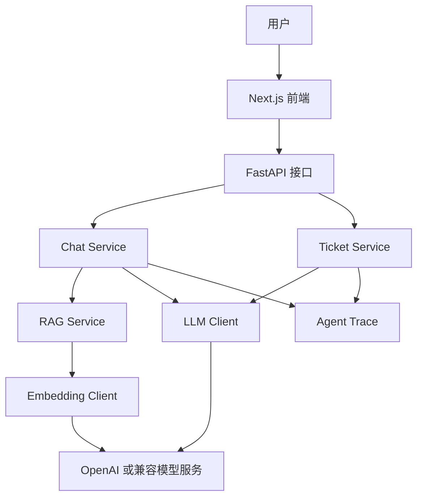

# Day 19：大模型接入设计文档

## 1. 文档目的

本文说明 Enterprise Support Agent 如何接入大模型，以及接入后应该优先实现哪些功能。

当前项目已经具备知识库、Chat、工单、审批和 Agent Trace 的业务闭环，但后端仍以本地规则和本地检索为主，没有真正调用外部大模型：

- Chat/RAG：当前根据检索到的最高相似度 chunk 拼接回答。
- Embedding：当前使用 `local-hash-v1` 本地 hash 向量。
- 工单草稿：当前使用关键词规则判断分类、优先级和标题。
- Agent Trace：已经记录了 `llm_input_summary` 和 `llm_output` 字段，但内容来自本地规则，不是真实模型输出。

大模型接入的目标不是“让所有逻辑都交给模型”，而是让模型承担自然语言理解、生成、归纳和结构化提取，仍由后端代码负责权限、状态流转、审批和审计。

## 2. 当前可接入位置

项目已经预留了以下配置：

```text
OPENAI_API_KEY=replace-with-your-key
LLM_MODEL=gpt-4.1-mini
EMBEDDING_MODEL=text-embedding-3-small
```

对应代码位置：

| 文件 | 当前作用 | 接入大模型后的变化 |
| --- | --- | --- |
| `backend/app/core/config.py` | 读取环境变量 | 继续读取模型配置，可增加超时、重试、开关 |
| `backend/app/services/rag_service.py` | 本地 embedding 和相似度检索 | 替换为真实 embedding，保留检索排序逻辑 |
| `backend/app/services/chat_service.py` | 根据检索结果生成回答 | 调用 LLM 生成有引用的中文回答 |
| `backend/app/services/ticket_service.py` | 关键词生成工单草稿 | 调用 LLM 提取标题、分类、优先级、描述 |
| `backend/app/services/trace_service.py` | 记录执行链路 | 记录真实模型输入摘要、输出、耗时和错误 |

## 3. 推荐架构

建议新增一个模型访问层，业务服务不要直接调用第三方 SDK。



建议新增文件：

```text
backend/app/services/llm_client.py
backend/app/services/embedding_client.py
backend/app/services/prompt_templates.py
```

职责划分：

- `llm_client.py`：统一封装大模型调用、超时、错误处理、JSON 输出解析。
- `embedding_client.py`：统一封装 embedding 调用，后续可替换供应商。
- `prompt_templates.py`：集中管理提示词，避免提示词散落在业务代码里。
- 业务服务只调用内部 client，不直接依赖具体模型 SDK。

## 4. 接入后优先实现的功能

### 4.1 知识库问答增强

当前能力：

- 根据用户问题检索知识库 chunk。
- 取最高相似度内容拼接成回答。
- 没有来源时返回固定拒答。

接入大模型后：

- 根据多个 chunk 综合生成自然语言回答。
- 回答必须带引用来源。
- 没有可靠来源时仍然拒答，不能让模型自由编造。
- 可以支持追问，例如“刚才那个 VPN 问题怎么处理？”。

推荐规则：

```text
只允许模型基于检索结果回答。
检索结果为空或低于阈值时，直接返回拒答。
模型输出必须包含 answer、citations、confidence 三类字段。
```

### 4.2 真实语义检索

当前能力：

- 使用本地 hash 方式生成 256 维向量。
- 适合本地演示，但语义理解有限。

接入 embedding 模型后：

- 文档 chunk 入库时生成真实 embedding。
- 用户问题也生成 embedding。
- 使用余弦相似度检索相关 chunk。
- 中文、英文、同义表达和跨句语义匹配会更准确。

落地时需要注意：

- 更换 embedding 模型后，需要重新解析或重新索引旧文档。
- `document_chunks.embedding_model` 应记录模型名称，避免不同模型向量混用。
- 单元测试不应直接调用真实模型，应使用 fake embedding client。

### 4.3 工单草稿生成

当前能力：

- 用关键词判断 `category` 和 `priority`。
- 从原文中裁剪标题。

接入大模型后：

- 从自然语言中提取结构化工单草稿。
- 更准确地区分 IT、HR、Finance、Admin、Other。
- 自动判断优先级，并给出判断理由。
- 对信息不足的请求返回需要追问的字段。

建议输出格式：

```json
{
  "title": "公司邮箱无法登录",
  "description": "用户反馈公司邮箱无法登录，影响正常办公。",
  "category": "IT",
  "priority": "medium",
  "confidence": 0.88,
  "reason": "描述中出现邮箱、登录等 IT 支持关键词，未体现紧急中断。"
}
```

### 4.4 意图识别与路由

接入大模型后，可以先判断用户意图，再决定走哪个后端流程：

| 用户输入 | 推荐意图 | 后续动作 |
| --- | --- | --- |
| “VPN 怎么配置？” | `knowledge_qa` | 检索知识库并回答 |
| “帮我创建一个邮箱无法登录工单” | `create_ticket` | 生成工单草稿 |
| “这个问题很紧急，马上处理” | `create_ticket` + `urgent` | 进入审批流程 |
| “我想看我的工单进度” | `ticket_query` | 查询工单列表或详情 |

意图识别结果必须写入 Agent Trace，便于管理员查看模型为什么走了某条路径。

### 4.5 审批风险判断

当前规则：

- `urgent` 工单进入审批。

接入大模型后，可以增加风险判断，但不能绕过人工审批：

- 判断用户请求是否涉及权限、账号、安全、财务、生产中断。
- 给出 `risk_level` 和 `risk_reason`。
- 高风险操作必须创建审批记录。
- 审批通过后仍由后端执行真实动作。

大模型只负责判断和解释，不能直接修改数据库状态。

### 4.6 Agent Trace 可解释性

接入大模型后，Trace 页面可以展示更多信息：

- 模型输入摘要。
- 命中的知识库 chunk。
- 模型输出。
- 工具调用参数。
- 是否触发审批。
- 模型耗时和失败原因。

这对调试非常重要，可以回答：

```text
为什么这个问题没有命中文档？
为什么系统建议创建工单？
为什么这个工单进入审批？
模型到底看到了哪些上下文？
```

## 5. 分阶段落地计划

### 阶段一：模型 Client 封装

目标：先把模型调用封装起来，不直接改业务逻辑。

建议任务：

- 新增 `llm_client.py`。
- 新增 `embedding_client.py`。
- 增加 fake client，供测试使用。
- 增加配置项：

```text
LLM_PROVIDER=openai
LLM_MODEL=gpt-4.1-mini
EMBEDDING_MODEL=text-embedding-3-small
LLM_TIMEOUT_SECONDS=30
LLM_MAX_RETRIES=2
LLM_ENABLED=false
```

验收标准：

- 没有 API key 时，系统仍可使用当前本地规则运行。
- 有 API key 且 `LLM_ENABLED=true` 时，可以调用模型。
- 单元测试不依赖外网和真实 API key。

### 阶段二：替换 Embedding

目标：先提升检索质量。

建议任务：

- 文档切 chunk 后调用 embedding client。
- 查询时调用 embedding client。
- 保留 `local-hash-v1` 作为 fallback。
- 增加重新索引入口，避免旧文档继续使用老向量。

验收标准：

- 上传文档后 chunk 中有真实 embedding。
- 搜索结果比关键词/hash 检索更稳定。
- Trace 中记录使用的 embedding 模型。

### 阶段三：RAG 回答接入 LLM

目标：让 AI 助手真正基于知识库生成回答。

建议任务：

- `chat_service.py` 检索 chunk 后调用 LLM。
- Prompt 中明确要求只基于引用材料回答。
- 模型输出结构化字段：回答、引用、置信度、是否建议创建工单。
- 无来源时保留拒答，不调用或不采纳模型自由回答。

验收标准：

- `/chat` 页面能返回更自然的中文回答。
- 回答保留引用来源。
- 没有命中文档时不会编造答案。
- Agent Trace 能看到模型输入摘要和输出。

### 阶段四：工单草稿接入 LLM

目标：让工单创建更像真实 AI Agent。

建议任务：

- `ticket_service.generate_ticket_draft` 调用 LLM 生成结构化草稿。
- 校验模型输出，只接受允许的分类和优先级。
- 模型输出不合法时回退到关键词规则。
- 前端仍允许用户手动修改草稿。

验收标准：

- 复杂自然语言能生成合理工单草稿。
- urgent 工单仍进入审批。
- 用户确认前不直接创建工单。

### 阶段五：意图路由和审批风险增强

目标：从“问答工具”升级到“企业支持 Agent”。

建议任务：

- 新增意图识别步骤。
- 根据意图路由到知识库、工单、审批或查询。
- 增加风险判断 prompt。
- Trace 页面展示意图、风险、工具调用和审批状态。

验收标准：

- 同一个 Chat 输入可以触发问答或工单草稿。
- 高风险动作必须进入审批。
- 管理员可以在 Trace 中复盘完整链路。

## 6. 关键 Prompt 设计

### 6.1 RAG 回答 Prompt

```text
你是企业支持智能体。请只根据给定的知识库片段回答用户问题。

规则：
1. 如果知识库片段不能支持答案，返回无法确认，并建议创建工单。
2. 不要编造政策、流程、联系人、链接或数字。
3. 回答必须使用中文。
4. 回答后列出引用来源编号。

用户问题：
{question}

知识库片段：
{retrieved_chunks}
```

### 6.2 工单草稿 Prompt

```text
你是企业服务台工单助手。请把用户描述转换成工单草稿。

只允许以下分类：
IT, HR, Finance, Admin, Other

只允许以下优先级：
low, medium, high, urgent

请输出 JSON：
{
  "title": "...",
  "description": "...",
  "category": "...",
  "priority": "...",
  "confidence": 0.0,
  "reason": "..."
}

用户描述：
{content}
```

### 6.3 意图识别 Prompt

```text
请判断用户输入属于哪类企业支持意图。

可选意图：
- knowledge_qa
- create_ticket
- ticket_query
- approval_query
- unknown

请输出 JSON：
{
  "intent": "...",
  "confidence": 0.0,
  "need_ticket": true,
  "need_approval": false,
  "reason": "..."
}

用户输入：
{content}
```

## 7. 安全与权限要求

大模型接入后必须保留后端硬规则：

- 登录和 RBAC 仍由 FastAPI 后端控制。
- 模型不能决定用户是否有权限。
- 模型不能直接写数据库。
- urgent 或高风险动作必须走审批。
- 所有模型输入、输出、工具调用和审批状态都要写入 Trace。
- API key 只能放在后端环境变量，不能暴露到前端。
- 发送给模型的上下文应最小化，避免无关个人信息进入 prompt。

特别需要防范：

- Prompt injection：用户或文档中出现“忽略上面规则”等内容时，模型不能执行。
- 幻觉回答：没有知识库来源时不能编造答案。
- 越权查询：用户不能借模型读取其他人的工单或审批。
- 成本失控：限制上下文长度、top_k、最大输出长度和重试次数。

## 8. 测试策略

单元测试不应该依赖真实大模型服务。

推荐测试方式：

- `FakeLLMClient`：固定返回结构化 JSON。
- `FakeEmbeddingClient`：固定返回可预测向量。
- 业务测试验证：
  - 无 API key 时 fallback 正常。
  - 模型 JSON 不合法时能降级。
  - RAG 无来源时拒答。
  - urgent 工单仍进入审批。
  - Trace 正确记录模型链路。

真实模型调用只放在手动验收或单独的集成测试里，并且默认跳过。

## 9. 推荐优先级

建议按以下顺序推进：

1. 封装 `LLMClient` 和 `EmbeddingClient`。
2. 替换 embedding，提高知识库检索质量。
3. 让 Chat/RAG 用 LLM 生成带引用回答。
4. 让工单草稿由 LLM 结构化生成。
5. 增加意图识别、风险判断和更完整的 Agent Trace。

最小可交付版本是：

```text
真实 embedding + RAG 大模型回答 + 工单草稿大模型提取 + Trace 记录
```

这四项完成后，项目就不再只是“前后端业务系统”，而是具备真实 AI Agent 能力的企业支持系统。
