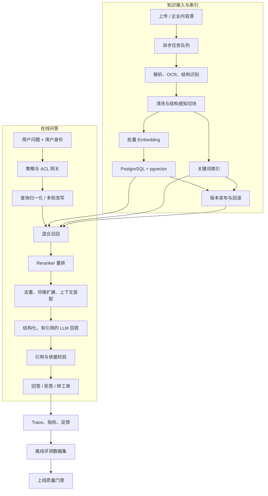

# Enterprise Support Agent 企业级 RAG 优化方案

> 文档类型：技术方案 / 演进路线图  
> 适用项目：Enterprise Support Agent  
> 目标读者：后端、AI 应用工程、架构、测试、安全与运维人员  
> 状态：实施中（Phase 0～4 核心已完成）

### 实施进度（2026-07-16）

- Phase 0：评测框架已完成，支持 Recall@K、MRR、nDCG@K；已提供样例集，真实业务黄金集仍需扩充到 100～200 条。
- Phase 1：pgvector 原生字段、幂等迁移、向量回填、HNSW 索引和数据库侧 Top-K 已完成。
- Phase 1：知识库范围、发布状态、生效/失效时间、角色 ACL 和管理员治理 API 已完成。
- Phase 2：结构感知切块、批量 embedding、文档版本、原子发布、持久化任务和独立 worker 已完成。
- Phase 3 核心：查询规范化、多轮改写、Dense + Lexical、RRF、可插拔 Reranker、MMR、去重、配额和 token 预算已完成。
- Phase 3 扩展：邻接块/父块扩展和真实 cross-encoder 接入待黄金集准备后推进。
- Phase 4 核心：claim 级引用校验、关键数字证据核验、Prompt Injection 拦截、Trace 敏感信息脱敏、部门 ACL 和文档密级已完成。
- Phase 4 扩展：NLI/LLM Judge 校准、用户组 ACL、外部内容源信任分级待黄金集和组织目录接入后推进。
- Phase 5 基础：ACL 安全的查询/检索缓存、持久化 revision 失效、分阶段指标、reranker 降级观测和本地容量基准已完成。
- Phase 5 可靠性：LLM、Embedding、Reranker 独立熔断、半开恢复、并发舱壁和运行指标已完成。
- Phase 5 运维：统一请求 Deadline、模型错误分类、HTTP 504 和 Prometheus 指标导出已完成。
- Phase 5 扩展：分布式限流、Redis、OpenTelemetry/OTLP、生产规模压测、灰度与反馈闭环待后续迭代。

## 1. 执行摘要

当前项目已经跑通“上传文档 → 文本切块 → 向量化 → 相似度检索 → LLM 回答 → 引用展示 → Trace”的最小闭环，但数据结构和检索方式仍属于 MVP 实现。企业级优化的核心不是单纯更换一个更大的模型，而是把知识接入、检索、生成、安全、评测和可观测性变成一套可持续运营的工程系统。

本方案建议继续使用当前 FastAPI、PostgreSQL 和 pgvector 技术栈，先完成以下四个最高优先级改造：

1. 将 `embedding_json` 升级为 pgvector 原生向量字段，在数据库内完成带 ACL 和元数据过滤的近邻检索。
2. 将固定字符切块升级为结构感知切块，并建立文档版本、内容指纹、索引版本和异步处理机制。
3. 将单路向量检索升级为“查询理解 + 混合召回 + 重排 + 上下文装配”的两阶段检索。
4. 建立黄金问题集和自动化评测门禁，用指标而不是主观观感决定模型、Prompt 和检索参数是否上线。

目标结果是：回答有据可查、权限不会越界、知识更新可追踪、质量可以量化、故障可以降级、规模增长时不需要推倒重做。

## 2. 当前实现与主要差距

### 2.1 已具备能力

- 支持 Markdown、TXT、简单 PDF 的上传与解析。
- 支持固定长度、带 overlap 的文档切块。
- 支持 OpenAI embedding，并保留 `local-hash-v1` 本地降级。
- 支持相似度阈值、Top-K 检索和文档名/页码/章节引用。
- 支持 LLM 结构化回答及引用编号校验。
- 检索为空时拒答，不允许无依据自由生成。
- 支持模型调用失败后的本地回答降级。
- Agent Trace 已记录检索结果、模型输出、工具和耗时。

### 2.2 关键差距

| 领域 | 当前实现 | 企业级风险 |
| --- | --- | --- |
| 向量存储与检索 | pgvector、HNSW、数据库侧 Top-K 已落地 | 需以生产数据验证百万级容量与 P95 延迟 |
| 切块与索引 | 结构感知切块、批量 embedding、版本原子发布已落地 | 表格、OCR、parent-child 扩展仍待完善 |
| 召回与排序 | Dense + Lexical、RRF、可插拔重排、MMR 已落地 | 真实 cross-encoder 仍需黄金集校准 |
| 权限 | 知识库、有效期、角色 ACL、部门 ACL、密级已落地 | 用户组 ACL 与企业组织目录同步尚未接入 |
| 生命周期 | 文档版本、发布/退役状态和持久化处理任务已落地 | 复审提醒、逻辑删除和删除证明尚未实现 |
| 生成 | Claim 级引用、数字证据与词项覆盖校验已落地 | 需用黄金集校准语义蕴含/NLI 能力 |
| 多轮问答 | 查询规范化与有限追问改写已落地 | 复杂问题分解与消歧仍待评测后引入 |
| 安全 | 用户/知识内容注入检测与 Trace 脱敏已落地 | 红队语料、审计权限和数据保留策略仍需建设 |
| 评测 | Recall@K、MRR、nDCG@K 框架已落地 | 真实业务黄金集仍需扩充到 100～200 条 |
| 可观测性 | Trace 已记录分路分数并默认脱敏 | 分阶段 P95、成本、告警和线上反馈闭环待建设 |

## 3. 设计目标与非目标

### 3.1 设计目标

- **可信**：回答中的关键事实必须能映射到具体文档版本和原文位置。
- **安全**：检索之前完成用户、部门、角色和知识库范围过滤，禁止先检索后脱敏。
- **高质量**：兼顾语义问题和关键词、编号、名称等精确查询。
- **可运营**：支持知识审核、发布、失效、回滚、重建索引和质量反馈。
- **可观测**：能够定位每次回答使用了什么查询、召回了什么、为什么被重排、花费多少。
- **可扩展**：在万级到百万级 chunk 增长过程中平滑扩容。
- **成本可控**：减少重复 embedding 和无效上下文，记录每次请求的 token 与模型成本。

### 3.2 本轮非目标

- 不建设开放式多 Agent 平台。
- 不让 LLM 直接决定权限或绕过业务审批。
- 不在第一阶段立即引入独立向量数据库。
- 不追求无限长期对话记忆。
- 不把所有文档原文发送给外部模型。

## 4. 目标架构



### 4.1 推荐模块边界

建议在现有 `services` 下逐步拆分以下模块：

```text
app/services/rag/
├── ingestion_service.py       # 接入、版本、任务状态
├── parser_service.py          # PDF/DOCX/HTML/OCR 解析适配
├── chunking_service.py        # 结构感知切块
├── index_service.py           # 批量 embedding、索引写入与切换
├── query_service.py           # 归一化、改写、过滤条件构建
├── retriever.py               # dense / lexical / hybrid 召回
├── reranker.py                # 二阶段排序
├── context_builder.py         # 去重、邻接扩展、token 预算
├── answer_service.py          # 生成与拒答策略
├── citation_validator.py      # 引用和依据校验
├── policy_service.py          # ACL、敏感信息与安全策略
└── evaluation_service.py      # 离线/在线评测
```

业务 API 只依赖统一的 `RAGPipeline.answer()`，不直接感知具体 embedding、检索器或 reranker 供应商。

## 5. 详细优化设计

### 5.1 数据模型与 pgvector 原生检索

#### 建议新增或调整的数据结构

`documents`：

- `knowledge_base_id`：所属知识库。
- `source_type/source_uri`：上传、网盘、Wiki 等来源。
- `content_hash`：文件内容指纹，用于去重。
- `current_version_id`：当前线上版本。
- `classification`：公开、内部、机密等分级。
- `owner_department_id`：资料责任部门。
- `effective_at/expires_at`：生效与失效时间。

`document_versions`：

- 保存每次内容、解析器、切块策略和索引版本。
- 状态采用 `draft → processing → ready → published → retired/failed`。
- 新版本索引完整成功后再原子切换为 `published`，避免半更新状态。

`document_chunks`：

- 将 `embedding_json` 替换为 `vector(N)` 原生字段。
- 增加 `chunk_uid`、`content_hash`、`token_count`、`language`。
- 增加 `heading_path`、`start_offset/end_offset`、`parent_chunk_id`。
- 增加 `embedding_model`、`embedding_dimensions`、`index_version`。
- 增加 `acl_scope` 或关联 ACL 表。
- 对 `(document_version_id, chunk_index)` 建唯一约束。

#### 检索方式

- 在 PostgreSQL 内完成距离计算、Top-K 和元数据过滤。
- 数据规模较小时使用精确检索；规模增长后建立 HNSW 索引。
- 查询条件必须同时包含：发布状态、生效时间、知识库范围和用户 ACL。
- embedding 模型不同的向量不能在同一个索引中混用；迁移时采用双写/双索引和原子切换。

#### 为什么暂不更换独立向量数据库

当前业务数据、权限和文档元数据都在 PostgreSQL，先使用 pgvector 可以保持事务和过滤的一致性，降低运维复杂度。当单库达到以下任一条件时，再评估独立检索集群：

- 有效 chunk 达到数百万级且持续高速增长。
- 检索 QPS 或 P95 延迟无法通过索引、读副本和缓存达到目标。
- 需要复杂中文全文检索、跨字段相关性或独立扩缩容。

### 5.2 企业知识接入流水线

#### 解析能力

- 在现有 Markdown、TXT、PDF 基础上增加 DOCX、HTML，按业务需要增加 PPTX/XLSX。
- PDF 同时保留页码、段落、标题、列表和表格结构。
- 对扫描件使用 OCR，并记录 OCR 置信度；低置信度内容不直接作为高可信依据。
- 清除页眉页脚、重复导航、乱码、不可见字符和无意义短段。
- 对表格生成“表格原文 + 可检索语义描述”，保留单元格坐标。

#### 异步与幂等

- 上传接口只创建文档和处理任务，返回 `202`。
- worker 执行解析、切块、批量 embedding 和索引写入。
- 每一步保存状态、错误码、重试次数和耗时。
- 使用 `content_hash + parser_version + chunker_version + embedding_model` 作为幂等键。
- 相同内容不重复 embedding；失败任务支持从最近成功阶段继续。
- 老版本在新版本完整发布后再下线。

#### 知识治理

- 文档必须有 owner、所属部门、密级、生效时间和复审时间。
- 支持草稿、审核、发布、失效和回滚。
- 到期文档不参与检索，并产生复审提醒。
- 删除采用先逻辑下线、后异步清理向量及原文件。

### 5.3 结构感知切块

固定 800 字符切块改为按文档结构切块：

1. 先按标题、段落、列表、表格、代码块和页面边界分段。
2. 小段合并到目标 token 区间，超长段按句子继续拆分。
3. 每个子 chunk 保存完整 `heading_path`，例如“IT 制度 > VPN > 故障排查”。
4. 对需要完整上下文的内容建立 parent-child：子块用于召回，父块用于生成。
5. overlap 仅在语义边界必要时使用，避免大量重复向量。

建议初始参数通过评测确定，而不是写死：

- 子 chunk：约 200～450 tokens。
- 父 chunk：约 700～1200 tokens。
- 在线上下文预算：根据模型窗口动态分配，不直接固定 chunk 数。

### 5.4 查询理解

检索前增加轻量查询处理：

- 规范化空格、全半角、大小写、日期和常见缩写。
- 识别部门、制度名、产品、错误码、时间范围等实体。
- 把多轮追问改写为独立问题，但必须保留原问题用于 Trace。
- 对复杂问题进行有限分解，例如“报销额度是多少、需要谁审批”拆成两个检索子问题。
- 生成查询过滤条件，如知识库、部门、文档类型、生效时间。
- 对已经明确的编号或专有名词，不让 LLM 过度改写。

查询改写失败时直接使用原问题，不阻断主链路。

### 5.5 混合召回

单路向量检索升级为至少两路：

- **Dense 召回**：处理同义表达、口语化问题和跨语言语义。
- **Lexical 召回**：处理制度编号、错误码、姓名、产品名和精确短语。

两路各召回候选后使用 RRF 或归一化加权融合。建议初始候选池：每路 20～50 条，融合后进入重排的候选不超过 50 条。

在当前 PostgreSQL 架构中，可先实现 pgvector + PostgreSQL 文本/模糊索引；如果中文分词质量或规模无法满足目标，再把 lexical 检索迁移到带中文分析器的 OpenSearch，`Retriever` 接口保持不变。

### 5.6 Reranker 与上下文装配

#### Reranker

- 使用 cross-encoder 或供应商 rerank API 对候选片段和问题做相关性重排。
- 将文档是否已发布、是否过期、来源可信等级作为额外排序特征。
- Reranker 故障时退回混合召回排序，不能让问答整体不可用。

#### Context Builder

- 对重复和高度相似 chunk 去重。
- 使用 MMR 或按文档配额控制多样性，防止单份文档占满上下文。
- 命中子 chunk 后可扩展相邻块或父块，但要重新计算 token 预算。
- 每个上下文项附带不可伪造的 `chunk_uid/document_version/page/section`。
- 优先保留直接回答问题的证据，背景信息放在剩余预算中。
- 若最高相关性、rerank 分数或证据覆盖不足，直接进入拒答/澄清/转工单策略。

### 5.7 生成、引用与拒答

#### 结构化输出

统一返回：

```json
{
  "answer": "...",
  "claims": [
    {"text": "...", "citation_ids": ["chunk-uid-1"]}
  ],
  "confidence": 0.0,
  "answerability": "answerable|partial|unanswerable",
  "suggest_ticket": false,
  "clarifying_question": null
}
```

#### 引用校验

- 引用必须使用后端发放的 chunk UID，不能只依赖显示序号。
- 校验引用 chunk 属于本次检索结果且用户有权访问。
- 对日期、金额、比例、联系人、步骤和权限等关键事实逐项检查证据覆盖。
- 可增加轻量 entailment/LLM judge，但最终上线门禁应以人工标注样本校准。
- 如果只有部分事实有依据，明确标记“部分可回答”，不能把未支持内容包装成确定结论。

#### 拒答策略

- 无召回：说明知识库未找到相关内容。
- 召回相关但证据不足：说明现有资料不足以确认。
- 多个有效版本冲突：展示冲突并提示责任部门确认。
- 无权限：不泄漏资料是否存在，仅提示当前账号无法获得答案。
- 高风险问题：回答流程性信息，不执行受控操作，并引导工单/审批。

### 5.8 ACL、数据安全与 Prompt Injection 防护

- 文档和 chunk 绑定知识库、部门、角色、用户组和密级。
- ACL 必须进入数据库检索条件，不能在检索完成后由应用层删除结果。
- 对外部内容源进行信任分级，未知来源默认不发布。
- 把检索内容包裹为数据区，系统 Prompt 明确禁止执行其中的指令。
- 检测“忽略系统规则”“导出其他用户资料”等注入特征，并记录安全事件。
- 在发送外部模型前做 PII/密钥/敏感字段策略检查；必要时脱敏或使用私有模型端点。
- Trace 默认不保存完整敏感原文或完整模型 payload，采用摘要、脱敏和访问审计。
- 文档、索引、原文件和备份均设置保留策略与删除证明。

### 5.9 缓存、性能和可靠性

- embedding 缓存键：`embedding_model + normalized_query_hash`。
- 检索缓存键必须包含 ACL scope、知识库范围和 index version，防止跨用户复用越权结果。
- 对高频稳定 FAQ 可缓存最终回答，但引用的文档版本变化后必须失效。
- embedding 使用批量接口；索引任务设置限流、指数退避和死信队列。
- LLM、embedding、reranker 分别设置超时、重试和熔断，不共享单一故障域。
- 在线降级顺序：完整混合 RAG → 无 rerank 的混合检索 → dense-only → 有依据的抽取式回答 → 拒答。
- 生产数据库使用连接池、只读副本、备份恢复演练和索引监控。

## 6. 评测体系与上线门禁

### 6.1 黄金数据集

建立版本化评测集，每条至少包含：

- 用户问题及常见改写。
- 用户角色、部门和允许访问的知识库。
- 期望命中的文档版本和 chunk。
- 标准答案或必须覆盖的事实点。
- 必须拒答、权限禁止、时效冲突和 Prompt Injection 样本。
- 问题类别：事实、流程、列表、对比、多跳、精确编号、多轮追问。

第一阶段建议 100～200 条高价值问题，覆盖 IT、HR、Finance、Admin；上线后从失败 Trace 和用户反馈持续补充。

### 6.2 核心指标

| 层级 | 指标 | 首期建议门槛 |
| --- | --- | --- |
| 解析 | 可解析文档成功率 | ≥ 99%，扫描件单独统计 |
| 检索 | Recall@10 | ≥ 85% |
| 检索 | nDCG@10 | ≥ 0.75 |
| 权限 | ACL 越权召回率 | 0 |
| 回答 | 关键事实引用覆盖率 | ≥ 95% |
| 回答 | 引用准确率 | ≥ 95% |
| 回答 | 无依据确定回答率 | ≤ 2% |
| 拒答 | 应答/拒答分类 F1 | ≥ 0.90 |
| 性能 | 在线问答 P95 | ≤ 4 秒，按模型部署校准 |
| 可用性 | RAG API 月可用性 | ≥ 99.9% |

这些门槛是首期目标，必须根据真实数据集和模型延迟基线校准。

### 6.3 评测流程

- 每个 Prompt、embedding、chunker、reranker 或阈值变更都生成配置版本。
- PR 阶段跑小型回归集；预发布阶段跑完整离线集。
- 新旧方案比较检索、回答、延迟和成本，任何安全指标下降都阻止上线。
- 使用 shadow traffic 或小流量灰度验证真实问题分布。
- 线上收集点赞/点踩、是否解决、转工单原因和用户选择的正确来源。
- 自动评审只做规模化辅助，定期抽样由知识 owner 复核。

## 7. 可观测性设计

在现有 Agent Trace 基础上增加统一 `run_id` 和阶段 span：

```text
query_received
→ acl_resolved
→ query_rewritten
→ dense_retrieved
→ lexical_retrieved
→ fused
→ reranked
→ context_built
→ answer_generated
→ citation_validated
→ response_returned
```

每个阶段记录：

- 配置版本、模型和索引版本。
- 候选数量、过滤数量、Top-K 分数和文档分布。
- token 数、缓存命中、调用次数、延迟和估算成本。
- 降级路径、错误类型和拒答原因。
- 用户身份只记录审计所需标识，敏感输入按策略脱敏。

建议建立以下面板和告警：

- P50/P95/P99 延迟及阶段分解。
- 无召回率、低置信拒答率、转工单率。
- embedding/reranker/LLM 错误与降级比例。
- 高失败查询、低评分文档和过期知识占比。
- 每个知识库、部门和模型的 token/成本。
- ACL 异常、注入攻击和敏感信息命中。

## 8. 分阶段实施计划

### Phase 0：基线与评测（1 周）

目标：先建立可比较的质量基线。

- 从现有测试、演示问题和 Trace 整理首批黄金数据集。
- 增加检索 Recall、引用准确率、拒答准确率和延迟统计。
- 固化当前 `local-hash` 与真实 embedding 两套基线。
- 为 RAG 配置生成版本号。

验收：任何后续改造都能用同一数据集与基线比较。

### Phase 1：存储与检索基础（1～2 周）

目标：消除全表加载和 JSON 向量瓶颈。

- 启用 pgvector extension，增加原生 vector 字段和索引。
- 增加文档版本、内容指纹、发布状态和基础 ACL 字段。
- 在数据库内完成 ACL + metadata filter + vector Top-K。
- 设计旧 JSON 向量的迁移、校验和回滚脚本。
- Trace 增加 index/model/config version。

验收：搜索 SQL 不再读取全部 chunk；ACL 越权测试为 0；结果不低于现有 Recall 基线。

### Phase 2：知识接入工程化（2 周）

目标：知识更新可靠、可回滚。

- 引入 worker 和任务状态，上传改为异步。
- 实现结构感知切块、批量 embedding、内容去重。
- 支持版本发布、失效、回滚和原子索引切换。
- 完善 PDF 结构解析，根据业务优先级加入 DOCX/OCR。
- 为解析器、chunker 和 embedding 建版本体系。

验收：失败任务可重试；重复内容不重复向量化；新版本失败不影响线上旧版本。

### Phase 3：检索质量升级（2 周）

目标：提升复杂问题和精确词查询的命中率。

- 增加 query normalization 和多轮独立问题改写。
- 增加 lexical 召回和 RRF 融合。
- 增加 reranker、去重、MMR、邻接/父块扩展。
- 通过离线实验确定 Top-K、融合权重、rerank K 和阈值。

验收：Recall@10 与 nDCG@10 达标；精确编号和口语问题均无明显退化；P95 在预算内。

### Phase 4：可信回答与安全治理（2 周）

目标：把“有引用”升级为“结论真的被引用支持”。

- 输出 claim-level citations 和 answerability。
- 增加事实覆盖、引用归属和版本冲突校验。
- 完成知识库/部门/角色/用户组 ACL。
- 增加敏感数据策略、注入检测和 Trace 脱敏。
- 建立无权限、冲突、过期资料和恶意文档评测集。

验收：ACL 越权为 0；无依据确定回答率和引用准确率达到门槛。

### Phase 5：运营与规模化（持续）

- 上线反馈闭环、失败聚类和知识缺口面板。
- 建立灰度、A/B、shadow 和一键回滚。
- 增加缓存、读副本、限流、熔断和容量压测。
- 依据真实规模决定是否引入 OpenSearch 或独立向量检索集群。

## 9. 对当前代码的具体改造映射

| 当前文件 | 建议改造 |
| --- | --- |
| `models/document.py` | 增加知识库、密级、owner、有效期和当前版本 |
| `models/document_chunk.py` | 使用 pgvector 字段，增加版本、UID、token、标题路径和 ACL |
| `document_processing_service.py` | 拆分 parser/chunker/indexer，改为异步批处理与幂等任务 |
| `embedding_client.py` | 增加 batch size、限流、缓存、指标和模型迁移支持 |
| `rag_service.py` | 拆成 query/retrieval/rerank/context 模块，删除 Python 全表余弦计算 |
| `chat_service.py` | 调用统一 RAGPipeline，加入多轮改写、answerability 和降级策略 |
| `prompt_templates.py` | 增加 Prompt 版本、claim-level citation 和冲突处理 |
| `trace_service.py` | 引入 run/span、阶段耗时、配置版本、token、成本和脱敏 |
| `api/search.py` | 支持知识库范围、过滤条件和调试模式；调试模式仅管理员可用 |
| `tests/test_rag_service.py` | 增加真实 PostgreSQL/pgvector 集成测试与黄金集回归 |

## 10. 关键技术决策

1. **保留 PostgreSQL + pgvector**：当前阶段能兼顾向量、元数据、ACL 和运维成本。
2. **先建立评测再调模型**：没有基线时，更换模型无法证明质量提升。
3. **权限过滤先于相似度返回**：企业知识安全优先于召回率。
4. **两阶段检索**：召回负责不遗漏，reranker 负责精确排序。
5. **文档版本与索引版本绑定**：任何回答都能复现当时使用的知识状态。
6. **LLM 只负责受约束生成**：权限、发布、阈值、拒答和工具执行仍由后端硬规则控制。
7. **所有外部模型均可降级**：reranker 或 LLM 故障不应扩大为整条服务不可用。

## 11. 风险与应对

| 风险 | 应对 |
| --- | --- |
| 更换 embedding 后新旧向量不可比 | 双索引构建、离线评测、原子切换、保留回滚窗口 |
| 混合检索提升召回但增加延迟 | 并行召回、限制候选池、缓存 query embedding、超时降级 |
| Reranker 成本和延迟过高 | 仅重排有限候选，按问题类型启用，保留无 rerank 路径 |
| ACL 条件导致索引效率下降 | 对组织/知识库字段建组合索引，压测真实权限分布 |
| 自动评测分数与人工体验不一致 | 人工标注校准 judge，关键类别设置独立指标 |
| Trace 泄露敏感内容 | 字段级脱敏、最小化存储、管理员审计、保留期限 |
| 文档更新造成回答漂移 | 版本发布、灰度索引、变更评测、引用固定到具体版本 |

## 12. 完成定义

企业级 RAG 的第一阶段完成，不以“接入了某个模型”为标准，而以下列结果为标准：

- 在线检索完全在索引侧完成，不再将全部 chunk 加载到应用内。
- 每条检索结果都经过 ACL、生效时间和发布版本过滤。
- 每个回答能够追溯到具体文档版本、页码/章节和 chunk UID。
- 文档更新失败不会污染线上索引，且可以回滚。
- 关键质量、安全、性能和成本指标都有基线、告警和上线门禁。
- 模型或检索组件故障时系统可以安全降级，最终宁可拒答也不编造或越权。

## 附录 A：建议的首批工作清单

按投入产出比排序：

1. 建立 100～200 条黄金问题集和当前质量基线。
2. 将 `embedding_json` 迁移到 pgvector 原生字段。
3. 把 `search()` 改为数据库内 Top-K + metadata/ACL filter。
4. 增加文档版本、发布状态、content hash 和有效期。
5. 将 embedding 改为批量异步任务。
6. 实现标题/段落/列表感知切块和 chunk UID。
7. 加入 lexical 召回和 RRF 融合。
8. 加入 reranker 与上下文去重/父块扩展。
9. 上线 claim-level citation 与依据覆盖校验。
10. 完善阶段 Trace、反馈闭环和回归门禁。
