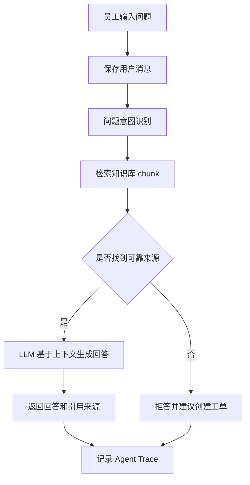
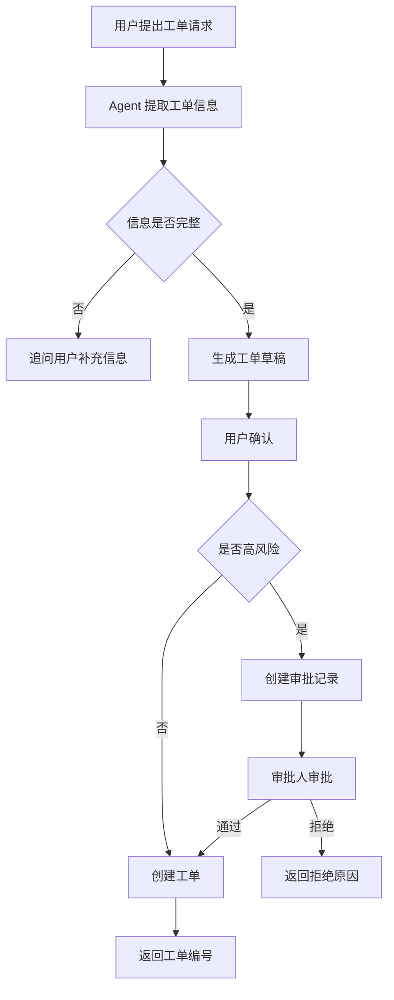
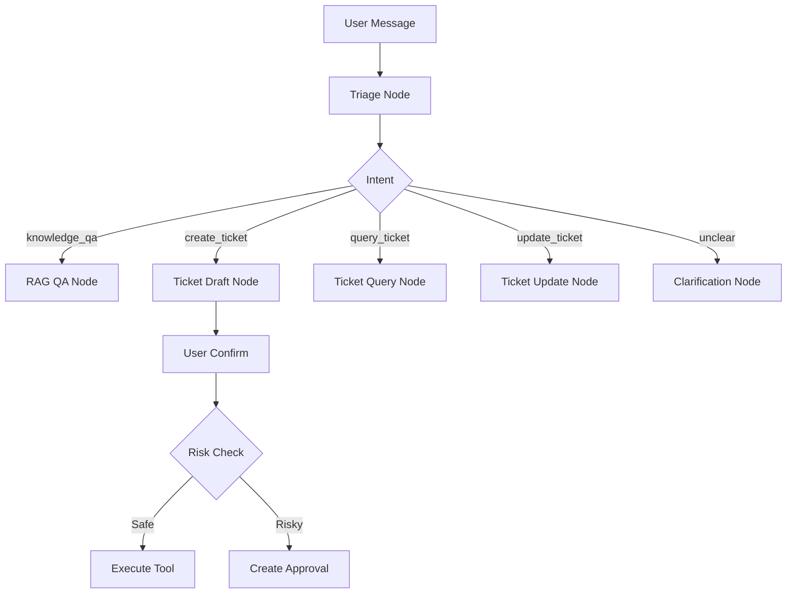
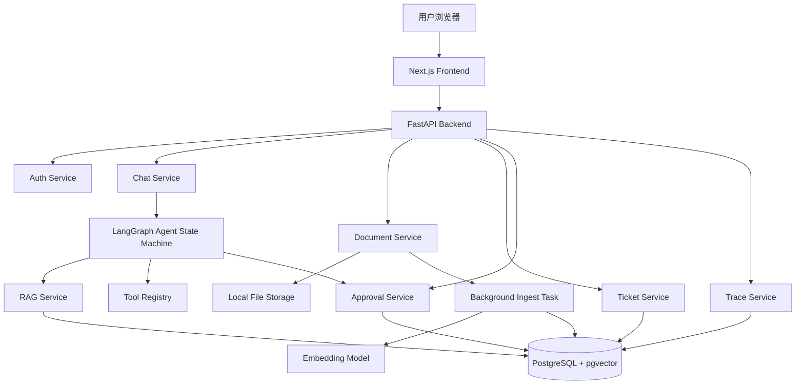

# Enterprise Support Agent 两周 MVP 需求文档

> 企业知识库问答 + 智能工单创建 + 人工审批 + Agent Trace
> 目标：两周内独立完成一个可演示、可写进简历、能体现 AI 应用工程能力的 MVP 项目。

---

## 1. 项目定位

Enterprise Support Agent 是一个面向企业内部员工的 AI 支持系统。员工可以上传或查询企业内部文档，例如 HR 制度、IT 操作文档、财务报销规范等，然后通过聊天方式提问。系统基于 RAG 检索知识库，生成带引用来源的回答。

当用户的问题无法仅靠知识库解决，或者用户明确要求“帮我提交工单”时，Agent 会自动生成工单草稿。用户确认后，系统创建工单。对于高风险操作，例如创建紧急工单、关闭工单、分派工单等，系统会进入人工审批流程，审批通过后再执行。

本项目不是完整的企业 SaaS，也不是低代码 Agent 平台，而是一个两周内可以独立完成的 AI 应用工程 MVP，重点展示：

* RAG 问答链路
* Agent 意图识别
* 工单工具调用
* Human-in-the-loop 人工审批
* Agent 执行日志与 Trace
* FastAPI 后端工程能力
* Docker Compose 本地部署能力

---

## 2. 两周 MVP 核心目标

### 2.1 必须完成的闭环

两周内必须跑通下面这条演示链路：

```text
管理员上传企业文档
→ 系统解析、切分、向量化并写入 pgvector
→ 员工在聊天页面提问
→ 系统检索相关 chunk
→ LLM 生成带引用来源的回答
→ 用户要求创建工单
→ Agent 生成工单草稿
→ 用户确认创建
→ 如果是普通工单，直接创建
→ 如果是高风险工单，进入审批
→ 审批人批准
→ 系统执行创建或更新操作
→ 管理员查看 Agent Trace
```

### 2.2 MVP 不追求的内容

两周版本不做以下内容：

* 多租户 SaaS
* 企业 SSO
* 复杂组织架构
* 拖拽式工作流
* 多 Agent 复杂协作
* Ragas 自动评测平台
* OpenTelemetry 全链路接入
* 大规模分布式向量检索
* Excel / Word 复杂解析
* 多模型路由
* 线上生产级权限系统
* 复杂指标看板
* 邮件、飞书、Slack、Jira 等外部系统集成

这些内容可以作为后续扩展方向写进 README，但不进入两周 MVP。

---

## 3. 用户角色

MVP 保留 4 种角色，但权限保持简单。

| 角色       | 说明    | 核心权限                      |
| -------- | ----- | ------------------------- |
| employee | 普通员工  | 提问、查看引用、创建工单、查看自己的工单      |
| handler  | 工单处理人 | 查看分配给自己的工单、更新状态、添加备注      |
| approver | 审批人   | 查看待审批操作、批准或拒绝             |
| admin    | 管理员   | 上传文档、管理文档、查看全部工单、查看 Trace |

MVP 阶段采用单角色字段 `role`，后续可以扩展为多角色表。

---

## 4. 核心业务流程

### 4.1 知识库问答流程



### 4.2 工单创建流程



### 4.3 审批流程

MVP 中只有以下操作需要审批：

* 创建 `urgent` 优先级工单
* 将工单状态改为 `closed`
* 将工单转派给其他处理人

审批通过后，系统执行原始工具调用；审批拒绝后，不执行工具调用，并记录拒绝原因。

---

## 5. 功能需求

## 5.1 登录与测试账号

MVP 不做注册流程，只提供种子账号。

测试账号：

| 角色    | 邮箱                                                  | 密码     |
| ----- | --------------------------------------------------- | ------ |
| 普通员工  | [employee@example.com](mailto:employee@example.com) | 123456 |
| 工单处理人 | [handler@example.com](mailto:handler@example.com)   | 123456 |
| 审批人   | [approver@example.com](mailto:approver@example.com) | 123456 |
| 管理员   | [admin@example.com](mailto:admin@example.com)       | 123456 |

登录后后端返回 JWT，前端根据用户角色展示不同入口。

---

## 5.2 文档管理

管理员可以上传文档。

MVP 支持格式：

* Markdown
* TXT
* 简单 PDF

暂不支持：

* DOCX
* CSV
* HTML
* Excel
* 扫描件 OCR
* 复杂表格解析

上传后系统执行：

1. 保存原始文件到本地目录。
2. 提取文本。
3. 按固定规则切分 chunk。
4. 调用 embedding 模型生成向量。
5. 写入 PostgreSQL + pgvector。
6. 更新文档处理状态。

文档状态：

```text
pending / processing / completed / failed
```

管理员可以：

* 查看文档列表
* 查看解析状态
* 查看 chunk 数量
* 删除文档
* 重新解析文档

---

## 5.3 AI 问答

用户在 Chat 页面提问。

系统返回：

* 回答内容
* 引用文档名称
* chunk 片段
* 页码或章节信息
* 是否建议创建工单

如果没有检索到可靠依据，系统必须拒答：

```text
我没有在当前知识库中找到可靠依据，暂时不能确认这个问题。你可以换个问法，或创建工单让相关部门处理。
```

MVP 约束：

* 回答必须基于检索结果。
* 不允许编造制度、金额、日期、联系人。
* 回答必须附带至少 1 个引用来源。
* 没有来源时不能给确定答案。
* 可以支持简单多轮追问，但不做复杂长期记忆。

---

## 5.4 工单草稿与创建

用户可以通过自然语言创建工单，例如：

```text
帮我创建一个 IT 工单，我的公司邮箱无法登录。
```

Agent 需要提取：

```json
{
  "title": "公司邮箱无法登录",
  "description": "用户反馈无法登录公司邮箱，需要 IT 排查账号状态或密码问题。",
  "category": "IT",
  "priority": "medium"
}
```

系统先返回工单草稿，由用户点击确认后再创建。

工单字段：

* 工单编号
* 标题
* 描述
* 分类
* 优先级
* 状态
* 创建人
* 处理人
* 来源对话
* 创建时间
* 更新时间

工单分类：

```text
IT / HR / Finance / Admin / Other
```

优先级：

```text
low / medium / high / urgent
```

状态：

```text
pending        待处理
in_progress    处理中
waiting_user   等待用户补充
resolved       已解决
closed         已关闭
rejected       已拒绝
```

---

## 5.5 工单管理

普通员工可以：

* 查看自己创建的工单
* 查看工单详情
* 查看处理人备注

工单处理人可以：

* 查看分配给自己的工单
* 修改状态为 `in_progress`
* 修改状态为 `waiting_user`
* 修改状态为 `resolved`
* 添加处理备注

管理员可以：

* 查看全部工单
* 修改处理人
* 修改状态
* 查看工单来源对话

MVP 不做复杂 SLA、通知、邮件提醒、附件上传。

---

## 5.6 人工审批

当工具调用命中高风险策略时，系统不直接执行，而是创建审批记录。

审批记录展示：

* 申请人
* 工具名称
* 工具参数
* 风险原因
* 来源对话
* Agent 决策理由
* 当前状态
* 审批意见

审批状态：

```text
pending / approved / rejected / executed / failed
```

审批人可以：

* 批准
* 拒绝
* 填写审批意见

审批通过后，系统执行原工具调用，并更新审批状态为 `executed`。

审批拒绝后，不执行工具调用，并向用户返回拒绝原因。

---

## 5.7 Agent Trace

每次 Chat 请求都需要记录一条 Trace，方便演示和面试讲解。

Trace 记录内容：

* 用户问题
* 意图识别结果
* 检索到的 chunk
* LLM 输入摘要
* LLM 输出
* 工具调用名称
* 工具调用参数
* 是否触发审批
* 最终结果
* 耗时
* 错误信息

MVP 不接入 OpenTelemetry，先自建 `agent_traces` 表即可。

---

## 6. Agent 设计

MVP 不做复杂多 Agent 协作，而是实现一个轻量状态机。

### 6.1 Agent 状态流转



### 6.2 意图类型

```json
{
  "intent": "knowledge_qa | create_ticket | query_ticket | update_ticket | clarification | out_of_scope",
  "department": "IT | HR | Finance | Admin | Other | Unknown",
  "confidence": 0.87,
  "need_ticket": true,
  "need_approval": false,
  "reason": "用户明确要求创建 IT 工单"
}
```

### 6.3 工具列表

MVP 只实现 5 个工具：

| 工具名                   | 说明     | 是否需要审批    |
| --------------------- | ------ | --------- |
| search_knowledge_base | 检索知识库  | 否         |
| create_ticket         | 创建普通工单 | urgent 需要 |
| query_ticket          | 查询工单   | 否         |
| update_ticket_status  | 更新工单状态 | closed 需要 |
| assign_ticket         | 分派工单   | 是         |

不做邮件通知、导出报告、外部 API 调用。

### 6.4 工具调用安全规则

工具执行前必须检查：

1. 当前用户是否登录。
2. 当前用户是否有权限。
3. 工具参数是否符合 schema。
4. `requester_id` 必须来自当前登录用户，不能相信 LLM 生成结果。
5. 是否命中审批规则。
6. 工具执行结果必须写入 Trace。

---

## 7. RAG 设计

### 7.1 文档切分

MVP 使用固定 chunk 策略：

```text
chunk_size = 800 中文字符
chunk_overlap = 120 中文字符
top_k = 5
```

切分时保留 metadata：

```json
{
  "document_id": "doc_001",
  "filename": "it_policy.pdf",
  "chunk_index": 3,
  "page": 5,
  "section": "VPN 使用说明"
}
```

### 7.2 检索策略

MVP 只做：

* pgvector 向量检索
* knowledge_base_id 过滤
* top_k 召回
* 相似度阈值判断
* 引用来源返回

暂不做：

* BM25 混合检索
* rerank
* query rewrite
* 上下文压缩
* 多路召回
* Excel 表格问答

### 7.3 回答生成约束

System Prompt 需要包含：

```text
你是企业知识库问答助手。
你只能根据提供的上下文回答。
如果上下文没有答案，必须说明无法从当前知识库确认。
不允许编造制度、金额、日期、流程、联系人。
回答末尾必须列出引用来源。
如果用户的问题更适合人工处理，可以建议创建工单。
```

---

## 8. 技术选型

### 8.1 MVP 技术栈

| 层级       | 技术                                  | 选择原因                     |
| -------- | ----------------------------------- | ------------------------ |
| 前端       | Next.js + React + TypeScript        | 快速实现 Chat、工单、审批、管理页面     |
| UI       | Tailwind CSS / shadcn/ui            | 页面好看，开发效率高               |
| 后端       | Python + FastAPI                    | 适合 AI 应用，接口开发快           |
| Agent 编排 | LangGraph 简化状态机                     | 展示 Agent Workflow、审批中断能力 |
| RAG      | LlamaIndex 或自定义轻量 RAG Service       | 快速完成文档切分、索引、查询           |
| 数据库      | PostgreSQL                          | 存业务数据                    |
| 向量检索     | pgvector                            | 存 chunk embedding，部署简单   |
| 文件存储     | 本地 storage 目录                       | 两周 MVP 足够                |
| 异步任务     | FastAPI BackgroundTasks             | 文档解析异步执行，避免引入 Celery     |
| 鉴权       | JWT + RBAC                          | 简单可控                     |
| 日志       | structlog / loguru + agent_traces 表 | 方便展示执行链路                 |
| 部署       | Docker Compose                      | 本地一键启动                   |

### 8.2 暂不引入的技术

两周内暂不引入：

* Celery
* Redis
* OpenTelemetry
* LangSmith
* Ragas
* Elasticsearch
* Milvus
* MinIO
* 企业 SSO
* OpenAI Agents SDK

这些可以作为后续扩展，不影响 MVP 闭环。

---

## 9. 系统架构



---

## 10. 后端模块划分

```text
backend/
  app/
    main.py
    core/
      config.py
      security.py
      logging.py
    api/
      auth.py
      chat.py
      documents.py
      tickets.py
      approvals.py
      traces.py
    services/
      rag_service.py
      document_service.py
      ticket_service.py
      approval_service.py
      trace_service.py
    agents/
      graph.py
      nodes.py
      prompts.py
      schemas.py
    tools/
      ticket_tools.py
      rag_tools.py
      policy.py
    models/
      user.py
      document.py
      chunk.py
      conversation.py
      message.py
      ticket.py
      approval.py
      trace.py
    db/
      session.py
      migrations/
    storage/
```

---

## 11. 前端页面

MVP 只做 5 个页面。

| 页面      | 路径                 | 说明                |
| ------- | ------------------ | ----------------- |
| 登录页     | `/login`           | 输入邮箱密码登录          |
| Chat 页  | `/chat`            | 提问、查看回答、引用、生成工单草稿 |
| 工单页     | `/tickets`         | 工单列表、详情、状态更新      |
| 审批页     | `/approvals`       | 查看待审批操作，批准或拒绝     |
| 文档管理页   | `/admin/documents` | 上传文档、查看解析状态       |
| Trace 页 | `/admin/traces`    | 查看 Agent 执行链路     |

如果时间不够，Trace 页可以先做成简单表格，不做复杂可视化。

---

## 12. 数据库设计

### 12.1 users

| 字段            | 类型        | 说明                                    |
| ------------- | --------- | ------------------------------------- |
| id            | uuid      | 用户 ID                                 |
| email         | varchar   | 邮箱                                    |
| name          | varchar   | 姓名                                    |
| password_hash | varchar   | 密码哈希                                  |
| role          | varchar   | employee / handler / approver / admin |
| department    | varchar   | 部门                                    |
| created_at    | timestamp | 创建时间                                  |
| updated_at    | timestamp | 更新时间                                  |

### 12.2 documents

| 字段            | 类型        | 说明                                        |
| ------------- | --------- | ----------------------------------------- |
| id            | uuid      | 文档 ID                                     |
| filename      | varchar   | 文件名                                       |
| file_type     | varchar   | 文件类型                                      |
| file_path     | varchar   | 本地文件路径                                    |
| status        | varchar   | pending / processing / completed / failed |
| error_message | text      | 解析失败原因                                    |
| chunk_count   | int       | chunk 数量                                  |
| uploaded_by   | uuid      | 上传人                                       |
| created_at    | timestamp | 创建时间                                      |
| updated_at    | timestamp | 更新时间                                      |

### 12.3 document_chunks

| 字段          | 类型        | 说明                |
| ----------- | --------- | ----------------- |
| id          | uuid      | chunk ID          |
| document_id | uuid      | 文档 ID             |
| content     | text      | chunk 内容          |
| embedding   | vector    | 向量                |
| metadata    | jsonb     | 页码、章节、chunk_index |
| created_at  | timestamp | 创建时间              |

建议索引：

```sql
CREATE INDEX idx_document_chunks_embedding
ON document_chunks USING hnsw (embedding vector_cosine_ops);

CREATE INDEX idx_document_chunks_document_id
ON document_chunks (document_id);
```

### 12.4 conversations

| 字段         | 类型        | 说明    |
| ---------- | --------- | ----- |
| id         | uuid      | 对话 ID |
| user_id    | uuid      | 用户 ID |
| title      | varchar   | 对话标题  |
| created_at | timestamp | 创建时间  |
| updated_at | timestamp | 更新时间  |

### 12.5 messages

| 字段              | 类型        | 说明                      |
| --------------- | --------- | ----------------------- |
| id              | uuid      | 消息 ID                   |
| conversation_id | uuid      | 对话 ID                   |
| role            | varchar   | user / assistant / tool |
| content         | text      | 消息内容                    |
| metadata        | jsonb     | 引用、工具调用、草稿信息            |
| created_at      | timestamp | 创建时间                    |

### 12.6 tickets

| 字段                     | 类型        | 说明                                                                  |
| ---------------------- | --------- | ------------------------------------------------------------------- |
| id                     | uuid      | 工单 ID                                                               |
| ticket_no              | varchar   | 工单编号                                                                |
| title                  | varchar   | 标题                                                                  |
| description            | text      | 描述                                                                  |
| category               | varchar   | IT / HR / Finance / Admin / Other                                   |
| priority               | varchar   | low / medium / high / urgent                                        |
| status                 | varchar   | pending / in_progress / waiting_user / resolved / closed / rejected |
| requester_id           | uuid      | 创建人                                                                 |
| assignee_id            | uuid      | 处理人，可为空                                                             |
| source_conversation_id | uuid      | 来源对话                                                                |
| created_at             | timestamp | 创建时间                                                                |
| updated_at             | timestamp | 更新时间                                                                |

### 12.7 ticket_comments

| 字段         | 类型        | 说明    |
| ---------- | --------- | ----- |
| id         | uuid      | 评论 ID |
| ticket_id  | uuid      | 工单 ID |
| author_id  | uuid      | 评论人   |
| content    | text      | 评论内容  |
| created_at | timestamp | 创建时间  |

### 12.8 approvals

| 字段               | 类型        | 说明                                                |
| ---------------- | --------- | ------------------------------------------------- |
| id               | uuid      | 审批 ID                                             |
| conversation_id  | uuid      | 来源对话                                              |
| tool_name        | varchar   | 工具名称                                              |
| tool_args        | jsonb     | 工具参数                                              |
| risk_reason      | text      | 风险原因                                              |
| status           | varchar   | pending / approved / rejected / executed / failed |
| requester_id     | uuid      | 发起人                                               |
| approver_id      | uuid      | 审批人                                               |
| decision_comment | text      | 审批意见                                              |
| execution_result | jsonb     | 执行结果                                              |
| idempotency_key  | varchar   | 幂等键                                               |
| created_at       | timestamp | 创建时间                                              |
| updated_at       | timestamp | 更新时间                                              |

### 12.9 agent_traces

| 字段               | 类型        | 说明        |
| ---------------- | --------- | --------- |
| id               | uuid      | Trace ID  |
| conversation_id  | uuid      | 对话 ID     |
| user_id          | uuid      | 用户 ID     |
| intent           | varchar   | 意图识别结果    |
| retrieved_chunks | jsonb     | 检索结果摘要    |
| tool_calls       | jsonb     | 工具调用      |
| approval_id      | uuid      | 审批 ID，可为空 |
| final_answer     | text      | 最终回答      |
| latency_ms       | int       | 耗时        |
| error_message    | text      | 错误信息      |
| created_at       | timestamp | 创建时间      |

---

## 13. API 设计

### 13.1 Auth API

| 方法   | 路径                | 说明     |
| ---- | ----------------- | ------ |
| POST | `/api/auth/login` | 登录     |
| GET  | `/api/auth/me`    | 获取当前用户 |

### 13.2 Document API

| 方法     | 路径                            | 说明   |
| ------ | ----------------------------- | ---- |
| POST   | `/api/documents/upload`       | 上传文档 |
| GET    | `/api/documents`              | 文档列表 |
| GET    | `/api/documents/{id}`         | 文档详情 |
| POST   | `/api/documents/{id}/reindex` | 重新解析 |
| DELETE | `/api/documents/{id}`         | 删除文档 |

### 13.3 Chat API

| 方法   | 路径                                      | 说明   |
| ---- | --------------------------------------- | ---- |
| POST | `/api/chat/conversations`               | 创建对话 |
| GET  | `/api/chat/conversations`               | 对话列表 |
| GET  | `/api/chat/conversations/{id}`          | 对话详情 |
| POST | `/api/chat/conversations/{id}/messages` | 发送消息 |

发送消息请求：

```json
{
  "message": "我电脑连不上 VPN，应该怎么办？"
}
```

普通问答响应：

```json
{
  "type": "answer",
  "answer": "你可以先检查 VPN 客户端版本、网络连接和账号状态。如果仍无法连接，建议创建 IT 工单。",
  "citations": [
    {
      "document_name": "IT 操作手册.pdf",
      "page": 5,
      "snippet": "VPN 无法连接时，请先确认客户端版本和账号状态。"
    }
  ],
  "suggested_action": {
    "type": "create_ticket",
    "reason": "该问题可能需要 IT 人工排查"
  }
}
```

工单草稿响应：

```json
{
  "type": "ticket_draft",
  "draft": {
    "title": "公司邮箱无法登录",
    "description": "用户反馈公司邮箱无法登录，需要 IT 排查。",
    "category": "IT",
    "priority": "medium"
  },
  "need_user_confirm": true
}
```

### 13.4 Ticket API

| 方法    | 路径                           | 说明        |
| ----- | ---------------------------- | --------- |
| POST  | `/api/tickets`               | 用户确认后创建工单 |
| GET   | `/api/tickets`               | 工单列表      |
| GET   | `/api/tickets/{id}`          | 工单详情      |
| PATCH | `/api/tickets/{id}`          | 更新工单      |
| POST  | `/api/tickets/{id}/comments` | 添加评论      |

### 13.5 Approval API

| 方法   | 路径                            | 说明      |
| ---- | ----------------------------- | ------- |
| GET  | `/api/approvals`              | 审批列表    |
| GET  | `/api/approvals/{id}`         | 审批详情    |
| POST | `/api/approvals/{id}/approve` | 审批通过并执行 |
| POST | `/api/approvals/{id}/reject`  | 审批拒绝    |

### 13.6 Trace API

| 方法  | 路径                                    | 说明            |
| --- | ------------------------------------- | ------------- |
| GET | `/api/traces`                         | Trace 列表      |
| GET | `/api/traces/{id}`                    | Trace 详情      |
| GET | `/api/chat/conversations/{id}/traces` | 查看某个对话的 Trace |

---

## 14. 错误处理

### 14.1 文档解析失败

前端展示：

```text
文档解析失败，请检查文件格式或重新上传。
```

后端记录：

* document_id
* filename
* error_message
* failed_at

### 14.2 检索不到依据

系统回答：

```text
我没有在当前知识库中找到可靠依据，暂时不能确认这个问题。你可以换个问法，或创建工单让相关部门处理。
```

### 14.3 LLM 调用失败

处理方式：

* 自动重试 1 次
* 失败后返回友好错误
* 写入 Agent Trace
* 不执行任何工具

### 14.4 工具调用失败

处理方式：

* 返回失败原因
* 记录工具参数
* 写入 Trace
* 敏感工具不自动重试

---

## 15. 两周开发计划

### Day 1：项目初始化

任务：

* 创建后端 FastAPI 项目
* 创建前端 Next.js 项目
* 配置 PostgreSQL + pgvector
* 配置 Docker Compose
* 初始化环境变量

交付：

* 前后端能启动
* 数据库能连接

### Day 2：数据库模型与登录

任务：

* 实现 users 表
* 实现 JWT 登录
* 实现 RBAC 依赖
* 写入 4 个测试账号
* 前端完成登录页

交付：

* 不同角色可以登录
* 登录后能拿到当前用户信息

### Day 3：文档上传与存储

任务：

* 实现文档上传接口
* 保存文件到本地 storage
* 实现 documents 表
* 前端文档上传页面
* 展示处理状态

交付：

* 管理员可以上传文档
* 文档状态可查看

### Day 4：文档解析与 chunk 切分

任务：

* 支持 Markdown / TXT 解析
* 支持简单 PDF 文本解析
* 实现 chunk 切分
* 保存 chunk metadata
* 记录 chunk_count

交付：

* 上传后可以生成 chunk

### Day 5：Embedding 与 pgvector 检索

任务：

* 接入 embedding 模型
* 写入 document_chunks.embedding
* 实现向量检索函数
* 返回 top_k chunk

交付：

* 后端可以根据问题检索相关 chunk

### Day 6：RAG 问答

任务：

* 实现 Chat API
* 实现 RAG Prompt
* LLM 基于 chunk 生成回答
* 返回引用来源
* 无依据时拒答

交付：

* 用户可以提问并获得带引用回答

### Day 7：对话与消息

任务：

* 实现 conversations 表
* 实现 messages 表
* 保存用户消息和 AI 回复
* 前端 Chat 页面展示历史消息

交付：

* 支持简单多轮对话

### Day 8：工单基础功能

任务：

* 实现 tickets 表
* 创建工单接口
* 工单列表接口
* 工单详情接口
* 前端工单列表和详情页

交付：

* 用户可以创建并查看工单

### Day 9：Agent 意图识别与工单草稿

任务：

* 实现 Triage Prompt
* 判断 knowledge_qa / create_ticket / clarification
* 实现工单草稿生成
* 前端展示确认弹窗

交付：

* 用户说“帮我创建工单”时，系统返回草稿而不是直接创建

### Day 10：审批流程

任务：

* 实现 approvals 表
* 实现风险判断规则
* urgent 工单进入审批
* 审批通过后执行原工具调用
* 审批拒绝后停止执行

交付：

* 高风险操作可以暂停、审批、恢复执行

### Day 11：工单处理与评论

任务：

* 实现更新工单状态
* 实现 ticket_comments
* 工单处理人可以添加备注
* 管理员可以查看全部工单

交付：

* 工单具备基本流转能力

### Day 12：Agent Trace

任务：

* 实现 agent_traces 表
* 记录意图识别、检索结果、工具调用、审批状态
* 前端 Trace 页面展示

交付：

* 管理员可以看到一次请求的完整执行链路

### Day 13：联调与优化

任务：

* 修复前后端联调问题
* 优化错误提示
* 增加加载状态
* 增加种子文档
* 增加 README 截图

交付：

* 完整演示流程可稳定跑通

### Day 14：包装与演示材料

任务：

* 编写 README
* 写启动说明
* 准备测试账号
* 录制演示 GIF
* 整理简历描述
* 准备面试讲解话术

交付：

* GitHub 项目可以展示
* 简历描述可以直接使用

---

## 16. 演示脚本

最终演示时按下面流程走：

1. 管理员登录。
2. 上传 `IT_VPN_FAQ.md`。
3. 等待解析完成，看到 chunk 数量。
4. 员工登录。
5. 提问：“我电脑连不上 VPN 怎么办？”
6. 系统返回带引用的回答。
7. 员工继续输入：“帮我创建一个 IT 工单。”
8. Agent 返回工单草稿。
9. 用户点击确认。
10. 系统创建普通工单并返回工单编号。
11. 用户输入：“帮我创建一个紧急工单，我邮箱完全无法登录。”
12. Agent 判断为 urgent，创建审批记录。
13. 审批人登录。
14. 查看审批详情，点击通过。
15. 系统执行创建工单。
16. 管理员查看 Trace，看到检索、LLM、工具调用、审批状态。

---

## 17. README 展示重点

README 不要写太散，重点突出 5 个亮点：

1. **RAG 问答可靠性**：回答必须带引用，无依据拒答。
2. **Agent 工具调用**：支持从自然语言生成工单草稿。
3. **Human-in-the-loop**：高风险操作需要人工审批。
4. **Agent Trace**：记录检索、LLM、工具调用、审批全过程。
5. **工程化部署**：FastAPI + PostgreSQL/pgvector + Docker Compose 一键启动。

推荐 README 项目标题：

```md
# Enterprise Support Agent

An AI Agent MVP for enterprise knowledge base Q&A, ticket automation, human approval, and execution tracing.
```

---

## 18. 简历描述

### 项目名称

企业知识库与智能工单处理 AI Agent

### 简历项目描述

基于 FastAPI、LangGraph、LlamaIndex、PostgreSQL/pgvector 构建企业内部支持 AI Agent MVP，支持企业文档上传解析、向量检索、知识库问答、来源引用、工单草稿生成、敏感操作人工审批和 Agent 执行链路追踪。系统通过 RAG 降低回答幻觉，通过 Human-in-the-loop 控制高风险工具调用，并使用自建 Trace 表记录检索结果、LLM 输出、工具参数、审批状态和执行结果，展示 AI 应用从问答到业务流程自动化的完整工程闭环。

### 简历亮点

* 实现企业文档 RAG 链路，支持 Markdown / TXT / PDF 解析、chunk 切分、embedding、pgvector 检索和引用来源返回。
* 基于 LangGraph 设计轻量 Agent 状态机，支持意图识别、知识问答、工单草稿生成和工具调用。
* 设计 Human-in-the-loop 审批机制，对 urgent 工单、关闭工单、分派工单等高风险操作进行审批中断和恢复执行。
* 使用 PostgreSQL + pgvector 统一存储业务数据和向量数据，降低本地部署复杂度。
* 构建 Agent Trace 日志，记录用户问题、检索片段、LLM 响应、工具调用、审批状态、耗时和错误信息。
* 使用 Docker Compose 提供本地一键启动环境，配套测试账号、种子文档和演示脚本。

---

## 19. 后续扩展方向

两周 MVP 完成后，可以继续扩展：

1. 接入 Redis + Celery，处理大文件解析和批量任务。
2. 增加 BM25 + 向量混合检索。
3. 增加 rerank，提高检索准确率。
4. 增加 Ragas 或自定义评测集。
5. 接入 OpenTelemetry 或 LangSmith。
6. 支持 DOCX、CSV、HTML。
7. 接入飞书、Slack、Jira、Zendesk。
8. 支持知识库权限继承。
9. 支持多 Agent：HR Agent、IT Agent、Finance Agent。
10. 支持线上部署和演示环境。

---

## 20. 一句话总结

Enterprise Support Agent 两周 MVP 聚焦一个可演示闭环：企业文档上传后进入 RAG 知识库，员工可以获得带引用的 AI 回答，也可以让 Agent 生成工单草稿；高风险操作需要人工审批，所有检索、LLM、工具调用和审批过程都会记录到 Agent Trace，适合用于展示 AI 应用工程师的核心工程能力。
